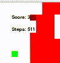
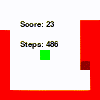
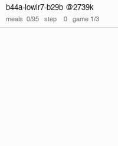

# Snek
Different agents that play snake, named by Josh

## TheSchlort
Random movements to learn how to control the snek.

## TheSchmid
Human-coded agent that tries. ~20% perfect game rate.

## TheSchlong
Reinforcement learning agent. ~76% perfect game rate.

## Snek2

Improvements on TheSchlong coded with Claude Code. ~99% perfect game rate.

## Snek3

PyTorch implementation of Snek2 and currently a work in progress.

Every arm's training and evaluation charts, paged eight at a time: [twang35.github.io/Snek](https://twang35.github.io/Snek/). 