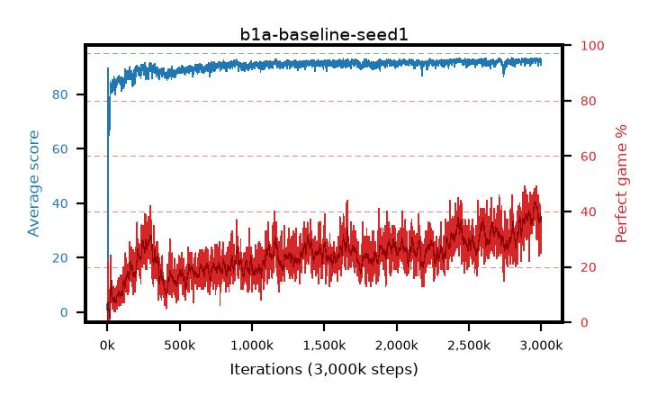

# b1a-baseline-seed1

step **3,000,000** · 3000 evals · trailing **92.26** · peak **92.66** @2,972,000 · sef **0.0** · best30 **42.1** @2,973,000

## Config

| | |
|---|---|
| adam_epsilon | 1e-07 |
| algo | dqn |
| batch_size | 128 |
| beta_anneal_steps | 300000 |
| collect_envs | 1 |
| discount | 0.99 |
| eval_interval | 1000 |
| fc_layers | (320,) |
| fork_branches | 4 |
| fork_max_steps | 60 |
| fork_min_length | 85 |
| fork_prob | 0.5 |
| gradient_clipping | 0.0 |
| graph_eval_episodes | 100 |
| guided_fraction | 0.8 |
| initial_collect_steps | 2000 |
| initial_epsilon | 0.4 |
| is_beta | 0.4 |
| is_beta_final | 1.0 |
| is_weights | True |
| learning_rate | 1e-05 |
| max_steps | 3000000 |
| min_checkpoint_score | 40.0 |
| min_epsilon | 0.002 |
| n_step_update | 1 |
| priority_exponent | 0.6 |
| replay_buffer_max_length | 100000 |
| replay_ratio | 1.0 |
| seed | 1 |
| target_update_period | 8 |
| target_update_tau | 1.0 |
| torch_threads | 1 |

## Evals

| step | avg score | trailing avg | min score | max score | avg reward | perfect % | epsilon |
|---|---|---|---|---|---|---|---|
| 1000 | 0.88 | 0.88 | 0.0 | 5.0 | 0.326 | 0.0 | 0.4 |
| 2000 | 4.49 | 2.69 | 1.0 | 22.0 | 3.918 | 0.0 | 0.2 |
| 3000 | 4.57 | 3.31 | 0.0 | 21.0 | 3.996 | 0.0 | 0.2 |
| ... | ... | ... | ... | ... | ... | ... | ... |
| 2989000 | 93.0 | 92.39 | 84.0 | 95.0 | 134.036 | 43.0 | 0.00512 |
| 2990000 | 92.27 | 92.38 | 45.0 | 95.0 | 127.318 | 37.0 | 0.00513 |
| 2991000 | 92.97 | 92.38 | 71.0 | 95.0 | 132.124 | 41.0 | 0.00513 |
| 2992000 | 92.58 | 92.38 | 69.0 | 95.0 | 126.908 | 36.0 | 0.00514 |
| 2993000 | 92.46 | 92.36 | 49.0 | 95.0 | 132.796 | 42.0 | 0.00514 |
| 2994000 | 93.17 | 92.39 | 85.0 | 95.0 | 132.139 | 41.0 | 0.00514 |
| 2995000 | 92.13 | 92.4 | 61.0 | 95.0 | 119.127 | 29.0 | 0.00519 |
| 2996000 | 91.9 | 92.35 | 37.0 | 95.0 | 124.87 | 35.0 | 0.00525 |
| 2997000 | 92.39 | 92.34 | 61.0 | 95.0 | 127.49 | 37.0 | 0.00526 |
| 2998000 | 92.53 | 92.32 | 77.0 | 95.0 | 126.704 | 36.0 | 0.0053 |
| 2999000 | 92.99 | 92.33 | 79.0 | 95.0 | 129.129 | 38.0 | 0.00527 |
| 3000000 | 90.77 | 92.26 | 45.0 | 95.0 | 113.806 | 25.0 | 0.00533 |
