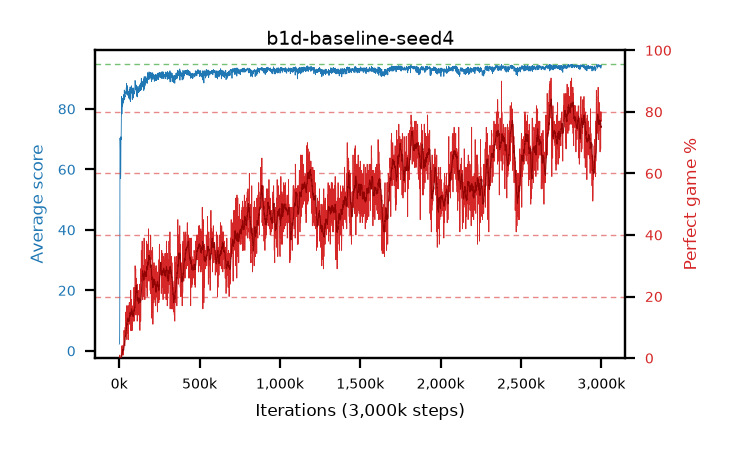

# b1d-baseline-seed4

step **3,000,000** · 3000 evals · trailing **94.17** · peak **94.34** @2,821,000 · sef **3.3** · best30 **81.9** @2,822,000

## Config

| | |
|---|---|
| adam_epsilon | 1e-07 |
| algo | dqn |
| batch_size | 128 |
| beta_anneal_steps | 300000 |
| collect_envs | 1 |
| discount | 0.99 |
| eval_interval | 1000 |
| fc_layers | (320,) |
| fork_branches | 4 |
| fork_max_steps | 60 |
| fork_min_length | 85 |
| fork_prob | 0.5 |
| gradient_clipping | 0.0 |
| graph_eval_episodes | 100 |
| guided_fraction | 0.8 |
| initial_collect_steps | 2000 |
| initial_epsilon | 0.4 |
| is_beta | 0.4 |
| is_beta_final | 1.0 |
| is_weights | True |
| learning_rate | 1e-05 |
| max_steps | 3000000 |
| min_checkpoint_score | 40.0 |
| min_epsilon | 0.002 |
| n_step_update | 1 |
| priority_exponent | 0.6 |
| replay_buffer_max_length | 100000 |
| replay_ratio | 1.0 |
| seed | 4 |
| target_update_period | 8 |
| target_update_tau | 1.0 |
| torch_threads | 1 |

## Evals

| step | avg score | trailing avg | min score | max score | avg reward | perfect % | epsilon |
|---|---|---|---|---|---|---|---|
| 1000 | 2.24 | 2.24 | 0.0 | 12.0 | 1.667 | 0.0 | 0.4 |
| 2000 | 2.63 | 2.44 | 0.0 | 12.0 | 2.057 | 0.0 | 0.4 |
| 3000 | 4.83 | 3.23 | 1.0 | 21.0 | 4.234 | 0.0 | 0.2 |
| ... | ... | ... | ... | ... | ... | ... | ... |
| 2989000 | 94.11 | 93.97 | 86.0 | 95.0 | 166.172 | 74.0 | 0.00224 |
| 2990000 | 93.86 | 93.99 | 78.0 | 95.0 | 168.132 | 76.0 | 0.00222 |
| 2991000 | 94.35 | 94.01 | 86.0 | 95.0 | 172.487 | 80.0 | 0.0022 |
| 2992000 | 94.02 | 94.06 | 86.0 | 95.0 | 159.062 | 67.0 | 0.0022 |
| 2993000 | 94.48 | 94.11 | 90.0 | 95.0 | 172.695 | 80.0 | 0.00216 |
| 2994000 | 94.2 | 94.16 | 85.0 | 95.0 | 165.255 | 73.0 | 0.00215 |
| 2995000 | 94.13 | 94.19 | 85.0 | 95.0 | 165.052 | 73.0 | 0.00216 |
| 2996000 | 93.76 | 94.21 | 68.0 | 95.0 | 159.497 | 68.0 | 0.00215 |
| 2997000 | 93.48 | 94.19 | 20.0 | 95.0 | 169.582 | 78.0 | 0.00214 |
| 2998000 | 94.31 | 94.19 | 86.0 | 95.0 | 172.436 | 80.0 | 0.00213 |
| 2999000 | 94.13 | 94.18 | 76.0 | 95.0 | 169.12 | 77.0 | 0.00215 |
| 3000000 | 94.24 | 94.17 | 78.0 | 95.0 | 169.172 | 77.0 | 0.00216 |
