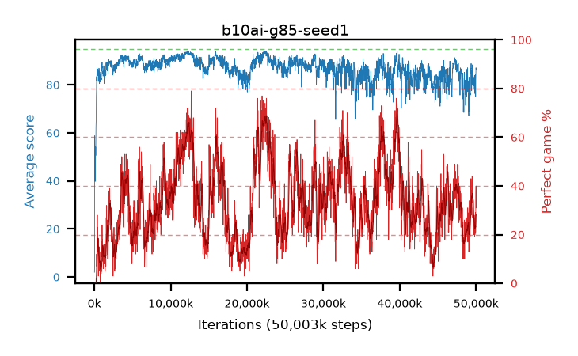

# b10ai-g85-seed1

step **50,003,968** · 3052 evals · trailing **82.2** · peak **93.34** @11,845,632 · sef **0.0** · best30 **67.2** @22,577,152

## Config

| | |
|---|---|
| algo | ppo |
| collect_envs | 128 |
| discount | 0.85 |
| eval_interval | 16384 |
| eval_queue | True |
| eval_queue_depth | 16 |
| eval_workers | 8 |
| fc_layers | (320,) |
| graph_eval_episodes | 100 |
| max_steps | 50003968 |
| min_checkpoint_score | 40.0 |
| ppo_adam_epsilon | 1e-07 |
| ppo_clip | 0.2 |
| ppo_clip_final | None |
| ppo_entropy_coef | 0.01 |
| ppo_entropy_coef_final | None |
| ppo_epochs | 4 |
| ppo_gae_lambda | 0.98 |
| ppo_gradient_clipping | 0.5 |
| ppo_horizon | 6.0 |
| ppo_learning_rate | 0.0003 |
| ppo_learning_rate_final | None |
| ppo_minibatch | 256 |
| ppo_normalize_adv | True |
| ppo_rollout | 128 |
| ppo_target_kl | 0.0 |
| ppo_transitions_per_rollout | 16384 |
| ppo_value_loss | huber |
| ppo_vf_coef | 0.5 |
| seed | 1 |
| torch_threads | 1 |

## Evals

| step | avg score | trailing avg | min score | max score | avg reward | perfect % | epsilon |
|---|---|---|---|---|---|---|---|
| 16384 | 1.97 | 1.97 | 0.0 | 11.0 | 1.47 | 0.0 |  |
| 32768 | 4.28 | 3.12 | 1.0 | 42.0 | 3.78 | 0.0 |  |
| 49152 | 58.81 | 30.81 | 29.0 | 85.0 | 55.115 | 0.0 |  |
| ... | ... | ... | ... | ... | ... | ... | ... |
| 49823744 | 83.95 | 83.01 | 16.0 | 95.0 | 101.95 | 19.0 |  |
| 49840128 | 82.77 | 83.25 | 13.0 | 95.0 | 106.65 | 25.0 |  |
| 49856512 | 76.36 | 83.1 | 20.0 | 95.0 | 94.77 | 20.0 |  |
| 49872896 | 81.34 | 82.83 | 20.0 | 95.0 | 103.095 | 23.0 |  |
| 49889280 | 81.86 | 82.57 | 15.0 | 95.0 | 107.685 | 27.0 |  |
| 49905664 | 75.88 | 82.08 | 16.0 | 95.0 | 96.28 | 22.0 |  |
| 49922048 | 84.35 | 82.41 | 17.0 | 95.0 | 112.3 | 29.0 |  |
| 49938432 | 75.14 | 81.94 | 16.0 | 95.0 | 94.545 | 21.0 |  |
| 49954816 | 81.97 | 82.24 | 12.0 | 95.0 | 111.775 | 31.0 |  |
| 49971200 | 83.95 | 81.79 | 16.0 | 95.0 | 119.905 | 37.0 |  |
| 49987584 | 87.1 | 81.82 | 17.0 | 95.0 | 126.22 | 40.0 |  |
| 50003968 | 86.23 | 82.2 | 13.0 | 95.0 | 116.305 | 31.0 |  |
