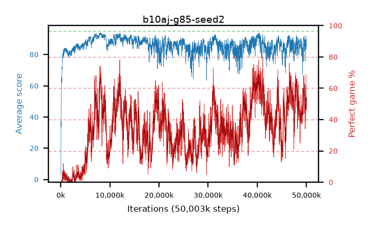

# b10aj-g85-seed2

step **50,003,968** · 3052 evals · trailing **86.37** · peak **93.07** @8,290,304 · sef **0.0** · best30 **64.1** @40,419,328

## Config

| | |
|---|---|
| algo | ppo |
| collect_envs | 128 |
| discount | 0.85 |
| eval_interval | 16384 |
| eval_queue | True |
| eval_queue_depth | 16 |
| eval_workers | 8 |
| fc_layers | (320,) |
| graph_eval_episodes | 100 |
| max_steps | 50003968 |
| min_checkpoint_score | 40.0 |
| ppo_adam_epsilon | 1e-07 |
| ppo_clip | 0.2 |
| ppo_clip_final | None |
| ppo_entropy_coef | 0.01 |
| ppo_entropy_coef_final | None |
| ppo_epochs | 4 |
| ppo_gae_lambda | 0.98 |
| ppo_gradient_clipping | 0.5 |
| ppo_horizon | 6.0 |
| ppo_learning_rate | 0.0003 |
| ppo_learning_rate_final | None |
| ppo_minibatch | 256 |
| ppo_normalize_adv | True |
| ppo_rollout | 128 |
| ppo_target_kl | 0.0 |
| ppo_transitions_per_rollout | 16384 |
| ppo_value_loss | huber |
| ppo_vf_coef | 0.5 |
| seed | 2 |
| torch_threads | 1 |

## Evals

| step | avg score | trailing avg | min score | max score | avg reward | perfect % | epsilon |
|---|---|---|---|---|---|---|---|
| 16384 | 2.76 | 2.76 | 1.0 | 7.0 | -1.25 | 0.0 |  |
| 32768 | 11.78 | 7.27 | 0.0 | 24.0 | 7.185 | 0.0 |  |
| 49152 | 30.64 | 23.25 | 0.0 | 60.0 | 25.955 | 0.0 |  |
| ... | ... | ... | ... | ... | ... | ... | ... |
| 49823744 | 86.07 | 86.0 | 17.0 | 95.0 | 125.915 | 41.0 |  |
| 49840128 | 89.51 | 87.05 | 16.0 | 95.0 | 127.635 | 39.0 |  |
| 49856512 | 86.23 | 86.94 | 16.0 | 95.0 | 139.1 | 54.0 |  |
| 49872896 | 90.55 | 86.61 | 20.0 | 95.0 | 144.595 | 55.0 |  |
| 49889280 | 88.86 | 84.87 | 22.0 | 95.0 | 140.915 | 53.0 |  |
| 49905664 | 86.43 | 86.48 | 15.0 | 95.0 | 143.19 | 58.0 |  |
| 49922048 | 91.89 | 87.13 | 16.0 | 95.0 | 159.91 | 69.0 |  |
| 49938432 | 85.48 | 87.1 | 14.0 | 95.0 | 136.27 | 52.0 |  |
| 49954816 | 89.26 | 85.02 | 15.0 | 95.0 | 142.265 | 54.0 |  |
| 49971200 | 85.57 | 86.85 | 14.0 | 95.0 | 130.345 | 46.0 |  |
| 49987584 | 83.6 | 86.57 | 14.0 | 95.0 | 130.14 | 48.0 |  |
| 50003968 | 84.36 | 86.37 | 14.0 | 95.0 | 134.925 | 52.0 |  |
