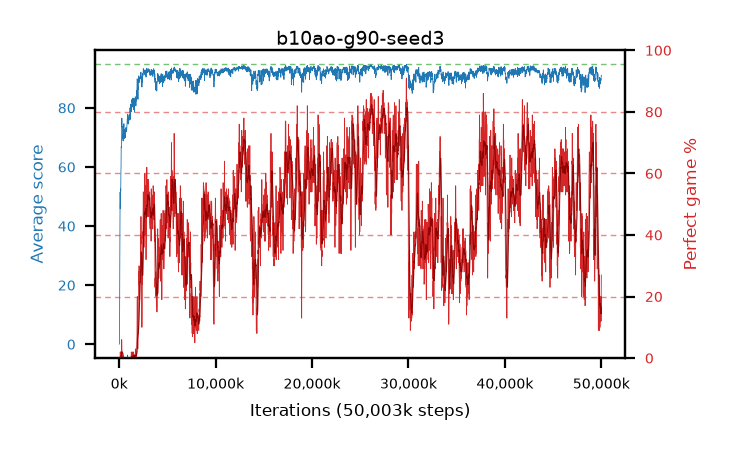

# b10ao-g90-seed3

step **50,003,968** · 3052 evals · trailing **89.67** · peak **93.96** @26,279,936 · sef **2.1** · best30 **79.4** @26,361,856

## Config

| | |
|---|---|
| algo | ppo |
| collect_envs | 128 |
| discount | 0.9 |
| eval_interval | 16384 |
| eval_queue | True |
| eval_queue_depth | 16 |
| eval_workers | 8 |
| fc_layers | (320,) |
| graph_eval_episodes | 100 |
| max_steps | 50003968 |
| min_checkpoint_score | 40.0 |
| ppo_adam_epsilon | 1e-07 |
| ppo_clip | 0.2 |
| ppo_clip_final | None |
| ppo_entropy_coef | 0.01 |
| ppo_entropy_coef_final | None |
| ppo_epochs | 4 |
| ppo_gae_lambda | 0.98 |
| ppo_gradient_clipping | 0.5 |
| ppo_horizon | 8.5 |
| ppo_learning_rate | 0.0003 |
| ppo_learning_rate_final | None |
| ppo_minibatch | 256 |
| ppo_normalize_adv | True |
| ppo_rollout | 128 |
| ppo_target_kl | 0.0 |
| ppo_transitions_per_rollout | 16384 |
| ppo_value_loss | huber |
| ppo_vf_coef | 0.5 |
| seed | 3 |
| torch_threads | 1 |

## Evals

| step | avg score | trailing avg | min score | max score | avg reward | perfect % | epsilon |
|---|---|---|---|---|---|---|---|
| 16384 | 0.05 | 0.05 | 0.0 | 1.0 | -0.495 | 0.0 |  |
| 32768 | 0.54 | 0.3 | 0.0 | 7.0 | 0.04 | 0.0 |  |
| 49152 | 22.44 | 13.02 | 0.0 | 37.0 | 18.34 | 0.0 |  |
| ... | ... | ... | ... | ... | ... | ... | ... |
| 49823744 | 86.63 | 89.86 | 33.0 | 95.0 | 95.085 | 9.0 |  |
| 49840128 | 89.01 | 89.76 | 67.0 | 95.0 | 103.435 | 15.0 |  |
| 49856512 | 88.25 | 90.62 | 57.0 | 95.0 | 97.7 | 10.0 |  |
| 49872896 | 88.9 | 90.11 | 62.0 | 95.0 | 102.24 | 14.0 |  |
| 49889280 | 89.07 | 90.55 | 67.0 | 95.0 | 102.455 | 14.0 |  |
| 49905664 | 89.25 | 90.46 | 67.0 | 95.0 | 103.63 | 15.0 |  |
| 49922048 | 88.17 | 90.35 | 18.0 | 95.0 | 105.445 | 18.0 |  |
| 49938432 | 89.98 | 90.27 | 66.0 | 95.0 | 106.26 | 17.0 |  |
| 49954816 | 89.28 | 89.54 | 16.0 | 95.0 | 108.59 | 20.0 |  |
| 49971200 | 90.23 | 89.48 | 74.0 | 95.0 | 101.67 | 12.0 |  |
| 49987584 | 90.62 | 90.65 | 57.0 | 95.0 | 109.975 | 20.0 |  |
| 50003968 | 91.05 | 89.67 | 77.0 | 95.0 | 117.37 | 27.0 |  |
