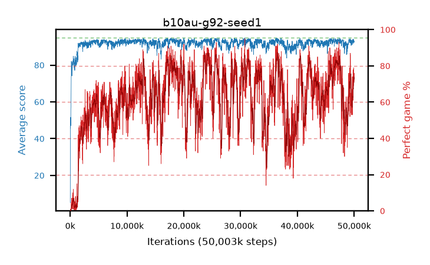

# b10au-g92-seed1

step **50,003,968** · 3052 evals · trailing **92.9** · peak **93.93** @25,919,488 · sef **15.4** · best30 **85.1** @24,477,696

## Config

| | |
|---|---|
| algo | ppo |
| collect_envs | 128 |
| discount | 0.92 |
| eval_interval | 16384 |
| eval_queue | True |
| eval_queue_depth | 16 |
| eval_workers | 8 |
| fc_layers | (320,) |
| graph_eval_episodes | 100 |
| max_steps | 50003968 |
| min_checkpoint_score | 40.0 |
| ppo_adam_epsilon | 1e-07 |
| ppo_clip | 0.2 |
| ppo_clip_final | None |
| ppo_entropy_coef | 0.01 |
| ppo_entropy_coef_final | None |
| ppo_epochs | 4 |
| ppo_gae_lambda | 0.98 |
| ppo_gradient_clipping | 0.5 |
| ppo_horizon | 10.2 |
| ppo_learning_rate | 0.0003 |
| ppo_learning_rate_final | None |
| ppo_minibatch | 256 |
| ppo_normalize_adv | True |
| ppo_rollout | 128 |
| ppo_target_kl | 0.0 |
| ppo_transitions_per_rollout | 16384 |
| ppo_value_loss | huber |
| ppo_vf_coef | 0.5 |
| seed | 1 |
| torch_threads | 1 |

## Evals

| step | avg score | trailing avg | min score | max score | avg reward | perfect % | epsilon |
|---|---|---|---|---|---|---|---|
| 16384 | 5.2 | 5.2 | 0.0 | 16.0 | 4.7 | 0.0 |  |
| 32768 | 47.3 | 36.28 | 3.0 | 82.0 | 42.84 | 0.0 |  |
| 49152 | 45.65 | 32.6 | 2.0 | 88.0 | 41.055 | 0.0 |  |
| ... | ... | ... | ... | ... | ... | ... | ... |
| 49823744 | 94.17 | 92.9 | 88.0 | 95.0 | 166.215 | 73.0 |  |
| 49840128 | 91.86 | 92.82 | 8.0 | 95.0 | 160.015 | 69.0 |  |
| 49856512 | 93.11 | 92.78 | 27.0 | 95.0 | 161.265 | 69.0 |  |
| 49872896 | 92.96 | 92.9 | 30.0 | 95.0 | 161.025 | 69.0 |  |
| 49889280 | 92.62 | 92.77 | 40.0 | 95.0 | 168.735 | 77.0 |  |
| 49905664 | 93.7 | 92.68 | 69.0 | 95.0 | 168.82 | 76.0 |  |
| 49922048 | 93.82 | 92.67 | 81.0 | 95.0 | 171.925 | 79.0 |  |
| 49938432 | 93.46 | 92.62 | 59.0 | 95.0 | 164.6 | 72.0 |  |
| 49954816 | 92.67 | 92.68 | 45.0 | 95.0 | 163.72 | 72.0 |  |
| 49971200 | 92.36 | 92.9 | 14.0 | 95.0 | 167.48 | 76.0 |  |
| 49987584 | 92.99 | 92.91 | 59.0 | 95.0 | 163.045 | 71.0 |  |
| 50003968 | 92.94 | 92.9 | 63.0 | 95.0 | 163.04 | 71.0 |  |
