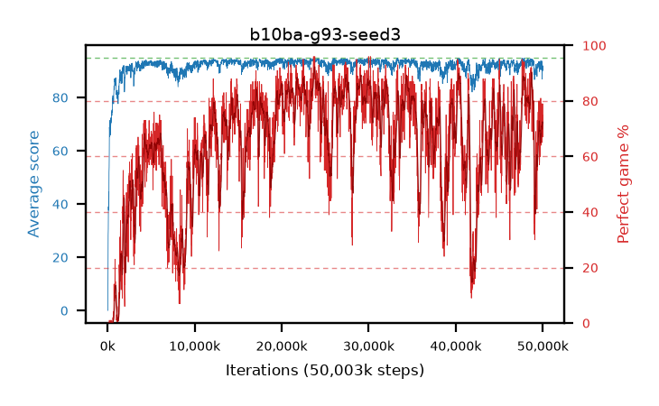

# b10ba-g93-seed3

step **50,003,968** · 3052 evals · trailing **91.58** · peak **94.19** @23,887,872 · sef **26.7** · best30 **88.5** @24,084,480

## Config

| | |
|---|---|
| algo | ppo |
| collect_envs | 128 |
| discount | 0.93 |
| eval_interval | 16384 |
| eval_queue | True |
| eval_queue_depth | 16 |
| eval_workers | 8 |
| fc_layers | (320,) |
| graph_eval_episodes | 100 |
| max_steps | 50003968 |
| min_checkpoint_score | 40.0 |
| ppo_adam_epsilon | 1e-07 |
| ppo_clip | 0.2 |
| ppo_clip_final | None |
| ppo_entropy_coef | 0.01 |
| ppo_entropy_coef_final | None |
| ppo_epochs | 4 |
| ppo_gae_lambda | 0.98 |
| ppo_gradient_clipping | 0.5 |
| ppo_horizon | 11.3 |
| ppo_learning_rate | 0.0003 |
| ppo_learning_rate_final | None |
| ppo_minibatch | 256 |
| ppo_normalize_adv | True |
| ppo_rollout | 128 |
| ppo_target_kl | 0.0 |
| ppo_transitions_per_rollout | 16384 |
| ppo_value_loss | huber |
| ppo_vf_coef | 0.5 |
| seed | 3 |
| torch_threads | 1 |

## Evals

| step | avg score | trailing avg | min score | max score | avg reward | perfect % | epsilon |
|---|---|---|---|---|---|---|---|
| 16384 | 0.05 | 0.05 | 0.0 | 1.0 | -0.45 | 0.0 |  |
| 32768 | 0.16 | 0.11 | 0.0 | 2.0 | -0.34 | 0.0 |  |
| 49152 | 14.41 | 4.87 | 0.0 | 41.0 | 12.02 | 0.0 |  |
| ... | ... | ... | ... | ... | ... | ... | ... |
| 49823744 | 91.17 | 91.87 | 26.0 | 95.0 | 160.32 | 70.0 |  |
| 49840128 | 91.76 | 91.81 | 28.0 | 95.0 | 162.9 | 72.0 |  |
| 49856512 | 90.37 | 91.76 | 41.0 | 95.0 | 160.515 | 71.0 |  |
| 49872896 | 93.72 | 91.7 | 69.0 | 95.0 | 171.825 | 79.0 |  |
| 49889280 | 90.99 | 91.81 | 6.0 | 95.0 | 157.155 | 67.0 |  |
| 49905664 | 92.29 | 91.84 | 24.0 | 95.0 | 169.355 | 78.0 |  |
| 49922048 | 86.93 | 91.84 | 5.0 | 95.0 | 151.105 | 65.0 |  |
| 49938432 | 91.69 | 92.0 | 3.0 | 95.0 | 165.725 | 75.0 |  |
| 49954816 | 89.88 | 91.68 | 30.0 | 95.0 | 157.945 | 69.0 |  |
| 49971200 | 91.97 | 91.68 | 40.0 | 95.0 | 170.075 | 79.0 |  |
| 49987584 | 91.33 | 91.63 | 55.0 | 95.0 | 157.36 | 67.0 |  |
| 50003968 | 90.41 | 91.58 | 3.0 | 95.0 | 159.515 | 70.0 |  |
