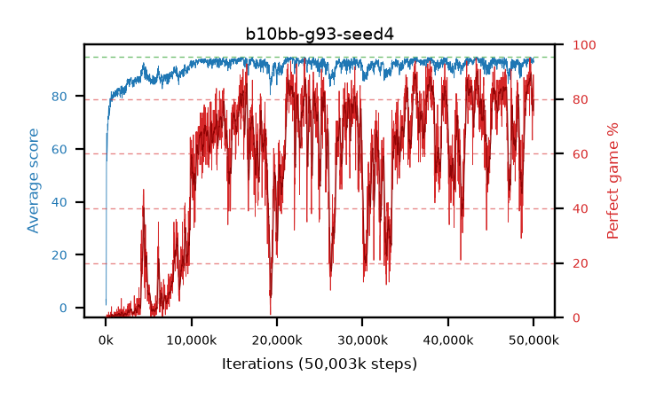

# b10bb-g93-seed4

step **50,003,968** · 3052 evals · trailing **93.65** · peak **94.22** @21,905,408 · sef **18.7** · best30 **87.1** @49,692,672

## Config

| | |
|---|---|
| algo | ppo |
| collect_envs | 128 |
| discount | 0.93 |
| eval_interval | 16384 |
| eval_queue | True |
| eval_queue_depth | 16 |
| eval_workers | 8 |
| fc_layers | (320,) |
| graph_eval_episodes | 100 |
| max_steps | 50003968 |
| min_checkpoint_score | 40.0 |
| ppo_adam_epsilon | 1e-07 |
| ppo_clip | 0.2 |
| ppo_clip_final | None |
| ppo_entropy_coef | 0.01 |
| ppo_entropy_coef_final | None |
| ppo_epochs | 4 |
| ppo_gae_lambda | 0.98 |
| ppo_gradient_clipping | 0.5 |
| ppo_horizon | 11.3 |
| ppo_learning_rate | 0.0003 |
| ppo_learning_rate_final | None |
| ppo_minibatch | 256 |
| ppo_normalize_adv | True |
| ppo_rollout | 128 |
| ppo_target_kl | 0.0 |
| ppo_transitions_per_rollout | 16384 |
| ppo_value_loss | huber |
| ppo_vf_coef | 0.5 |
| seed | 4 |
| torch_threads | 1 |

## Evals

| step | avg score | trailing avg | min score | max score | avg reward | perfect % | epsilon |
|---|---|---|---|---|---|---|---|
| 16384 | 3.06 | 3.06 | 0.0 | 10.0 | 0.58 | 0.0 |  |
| 32768 | 0.95 | 2.0 | 0.0 | 7.0 | 0.45 | 0.0 |  |
| 49152 | 1.56 | 1.86 | 0.0 | 27.0 | 1.06 | 0.0 |  |
| ... | ... | ... | ... | ... | ... | ... | ... |
| 49823744 | 92.86 | 93.76 | 62.0 | 95.0 | 160.97 | 69.0 |  |
| 49840128 | 92.28 | 93.61 | 8.0 | 95.0 | 156.14 | 65.0 |  |
| 49856512 | 93.43 | 93.73 | 53.0 | 95.0 | 162.58 | 70.0 |  |
| 49872896 | 93.3 | 93.74 | 41.0 | 95.0 | 167.425 | 75.0 |  |
| 49889280 | 93.74 | 93.73 | 63.0 | 95.0 | 171.845 | 79.0 |  |
| 49905664 | 93.67 | 93.82 | 12.0 | 95.0 | 180.73 | 88.0 |  |
| 49922048 | 94.17 | 93.78 | 78.0 | 95.0 | 175.215 | 82.0 |  |
| 49938432 | 94.14 | 93.8 | 79.0 | 95.0 | 174.235 | 81.0 |  |
| 49954816 | 94.43 | 93.83 | 84.0 | 95.0 | 182.485 | 89.0 |  |
| 49971200 | 92.75 | 93.79 | 20.0 | 95.0 | 174.835 | 83.0 |  |
| 49987584 | 92.83 | 93.7 | 37.0 | 95.0 | 167.95 | 76.0 |  |
| 50003968 | 93.29 | 93.65 | 44.0 | 95.0 | 166.42 | 74.0 |  |
