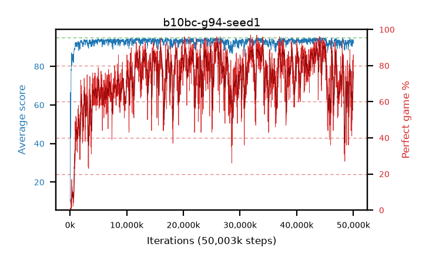

# b10bc-g94-seed1

step **50,003,968** · 3052 evals · trailing **92.24** · peak **94.2** @44,679,168 · sef **37.7** · best30 **90.2** @26,017,792

## Config

| | |
|---|---|
| algo | ppo |
| collect_envs | 128 |
| discount | 0.94 |
| eval_interval | 16384 |
| eval_queue | True |
| eval_queue_depth | 16 |
| eval_workers | 8 |
| fc_layers | (320,) |
| graph_eval_episodes | 100 |
| max_steps | 50003968 |
| min_checkpoint_score | 40.0 |
| ppo_adam_epsilon | 1e-07 |
| ppo_clip | 0.2 |
| ppo_clip_final | None |
| ppo_entropy_coef | 0.01 |
| ppo_entropy_coef_final | None |
| ppo_epochs | 4 |
| ppo_gae_lambda | 0.98 |
| ppo_gradient_clipping | 0.5 |
| ppo_horizon | 12.7 |
| ppo_learning_rate | 0.0003 |
| ppo_learning_rate_final | None |
| ppo_minibatch | 256 |
| ppo_normalize_adv | True |
| ppo_rollout | 128 |
| ppo_target_kl | 0.0 |
| ppo_transitions_per_rollout | 16384 |
| ppo_value_loss | huber |
| ppo_vf_coef | 0.5 |
| seed | 1 |
| torch_threads | 1 |

## Evals

| step | avg score | trailing avg | min score | max score | avg reward | perfect % | epsilon |
|---|---|---|---|---|---|---|---|
| 16384 | 9.76 | 9.76 | 0.0 | 26.0 | 9.215 | 0.0 |  |
| 32768 | 14.79 | 30.16 | 0.0 | 82.0 | 13.75 | 0.0 |  |
| 49152 | 56.31 | 35.39 | 16.0 | 95.0 | 54.015 | 1.0 |  |
| ... | ... | ... | ... | ... | ... | ... | ... |
| 49823744 | 90.43 | 92.33 | 13.0 | 95.0 | 139.545 | 50.0 |  |
| 49840128 | 93.6 | 92.31 | 81.0 | 95.0 | 158.77 | 66.0 |  |
| 49856512 | 91.34 | 92.06 | 22.0 | 95.0 | 152.44 | 62.0 |  |
| 49872896 | 91.48 | 92.1 | 18.0 | 95.0 | 173.43 | 83.0 |  |
| 49889280 | 92.57 | 92.07 | 21.0 | 95.0 | 159.685 | 68.0 |  |
| 49905664 | 92.56 | 92.06 | 53.0 | 95.0 | 158.68 | 67.0 |  |
| 49922048 | 94.09 | 92.11 | 82.0 | 95.0 | 174.185 | 81.0 |  |
| 49938432 | 92.7 | 92.08 | 7.0 | 95.0 | 171.8 | 80.0 |  |
| 49954816 | 93.87 | 92.33 | 64.0 | 95.0 | 175.91 | 83.0 |  |
| 49971200 | 92.15 | 92.19 | 16.0 | 95.0 | 174.235 | 83.0 |  |
| 49987584 | 93.44 | 92.28 | 19.0 | 95.0 | 178.465 | 86.0 |  |
| 50003968 | 92.23 | 92.24 | 12.0 | 95.0 | 164.365 | 73.0 |  |
