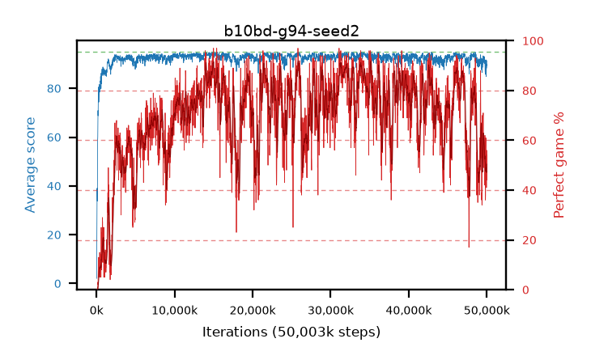

# b10bd-g94-seed2

step **50,003,968** · 3052 evals · trailing **90.38** · peak **94.1** @21,643,264 · sef **33.3** · best30 **89.0** @32,047,104

## Config

| | |
|---|---|
| algo | ppo |
| collect_envs | 128 |
| discount | 0.94 |
| eval_interval | 16384 |
| eval_queue | True |
| eval_queue_depth | 16 |
| eval_workers | 8 |
| fc_layers | (320,) |
| graph_eval_episodes | 100 |
| max_steps | 50003968 |
| min_checkpoint_score | 40.0 |
| ppo_adam_epsilon | 1e-07 |
| ppo_clip | 0.2 |
| ppo_clip_final | None |
| ppo_entropy_coef | 0.01 |
| ppo_entropy_coef_final | None |
| ppo_epochs | 4 |
| ppo_gae_lambda | 0.98 |
| ppo_gradient_clipping | 0.5 |
| ppo_horizon | 12.7 |
| ppo_learning_rate | 0.0003 |
| ppo_learning_rate_final | None |
| ppo_minibatch | 256 |
| ppo_normalize_adv | True |
| ppo_rollout | 128 |
| ppo_target_kl | 0.0 |
| ppo_transitions_per_rollout | 16384 |
| ppo_value_loss | huber |
| ppo_vf_coef | 0.5 |
| seed | 2 |
| torch_threads | 1 |

## Evals

| step | avg score | trailing avg | min score | max score | avg reward | perfect % | epsilon |
|---|---|---|---|---|---|---|---|
| 16384 | 2.1 | 2.1 | 0.0 | 6.0 | -1.01 | 0.0 |  |
| 32768 | 11.26 | 6.68 | 0.0 | 22.0 | 6.44 | 0.0 |  |
| 49152 | 21.54 | 14.57 | 0.0 | 49.0 | 16.72 | 0.0 |  |
| ... | ... | ... | ... | ... | ... | ... | ... |
| 49823744 | 85.71 | 90.55 | 8.0 | 95.0 | 120.58 | 36.0 |  |
| 49840128 | 88.48 | 90.48 | 14.0 | 95.0 | 125.565 | 38.0 |  |
| 49856512 | 89.84 | 90.51 | 6.0 | 95.0 | 144.88 | 56.0 |  |
| 49872896 | 91.13 | 90.62 | 19.0 | 95.0 | 151.28 | 61.0 |  |
| 49889280 | 91.67 | 90.51 | 20.0 | 95.0 | 137.755 | 47.0 |  |
| 49905664 | 88.77 | 90.58 | 6.0 | 95.0 | 134.855 | 47.0 |  |
| 49922048 | 84.84 | 90.39 | 8.0 | 95.0 | 130.655 | 47.0 |  |
| 49938432 | 89.7 | 90.54 | 21.0 | 95.0 | 139.765 | 51.0 |  |
| 49954816 | 88.24 | 90.27 | 18.0 | 95.0 | 128.4 | 41.0 |  |
| 49971200 | 89.97 | 90.27 | 10.0 | 95.0 | 144.92 | 56.0 |  |
| 49987584 | 89.32 | 90.24 | 41.0 | 95.0 | 132.555 | 44.0 |  |
| 50003968 | 91.33 | 90.38 | 9.0 | 95.0 | 144.38 | 54.0 |  |
