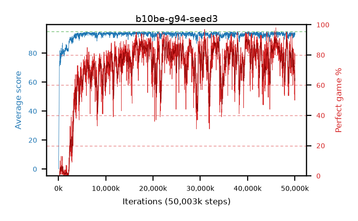

# b10be-g94-seed3

step **50,003,968** · 3052 evals · trailing **92.75** · peak **93.92** @6,553,600 · sef **40.9** · best30 **89.8** @46,071,808

## Config

| | |
|---|---|
| algo | ppo |
| collect_envs | 128 |
| discount | 0.94 |
| eval_interval | 16384 |
| eval_queue | True |
| eval_queue_depth | 16 |
| eval_workers | 8 |
| fc_layers | (320,) |
| graph_eval_episodes | 100 |
| max_steps | 50003968 |
| min_checkpoint_score | 40.0 |
| ppo_adam_epsilon | 1e-07 |
| ppo_clip | 0.2 |
| ppo_clip_final | None |
| ppo_entropy_coef | 0.01 |
| ppo_entropy_coef_final | None |
| ppo_epochs | 4 |
| ppo_gae_lambda | 0.98 |
| ppo_gradient_clipping | 0.5 |
| ppo_horizon | 12.7 |
| ppo_learning_rate | 0.0003 |
| ppo_learning_rate_final | None |
| ppo_minibatch | 256 |
| ppo_normalize_adv | True |
| ppo_rollout | 128 |
| ppo_target_kl | 0.0 |
| ppo_transitions_per_rollout | 16384 |
| ppo_value_loss | huber |
| ppo_vf_coef | 0.5 |
| seed | 3 |
| torch_threads | 1 |

## Evals

| step | avg score | trailing avg | min score | max score | avg reward | perfect % | epsilon |
|---|---|---|---|---|---|---|---|
| 16384 | 0.05 | 0.05 | 0.0 | 1.0 | -0.585 | 0.0 |  |
| 32768 | 0.32 | 0.18 | 0.0 | 2.0 | -0.18 | 0.0 |  |
| 49152 | 9.76 | 3.38 | 1.0 | 26.0 | 7.01 | 0.0 |  |
| ... | ... | ... | ... | ... | ... | ... | ... |
| 49823744 | 93.4 | 93.16 | 43.0 | 95.0 | 160.56 | 68.0 |  |
| 49840128 | 91.1 | 92.98 | 14.0 | 95.0 | 160.25 | 70.0 |  |
| 49856512 | 92.44 | 92.93 | 5.0 | 95.0 | 159.6 | 68.0 |  |
| 49872896 | 93.16 | 92.88 | 12.0 | 95.0 | 162.31 | 70.0 |  |
| 49889280 | 91.74 | 92.79 | 24.0 | 95.0 | 144.97 | 54.0 |  |
| 49905664 | 92.09 | 92.74 | 52.0 | 95.0 | 151.245 | 60.0 |  |
| 49922048 | 93.36 | 92.74 | 78.0 | 95.0 | 154.55 | 62.0 |  |
| 49938432 | 93.91 | 92.78 | 86.0 | 95.0 | 163.06 | 70.0 |  |
| 49954816 | 92.82 | 92.78 | 77.0 | 95.0 | 147.995 | 56.0 |  |
| 49971200 | 92.42 | 92.76 | 63.0 | 95.0 | 141.67 | 50.0 |  |
| 49987584 | 94.25 | 92.76 | 86.0 | 95.0 | 174.345 | 81.0 |  |
| 50003968 | 92.68 | 92.75 | 14.0 | 95.0 | 165.765 | 74.0 |  |
