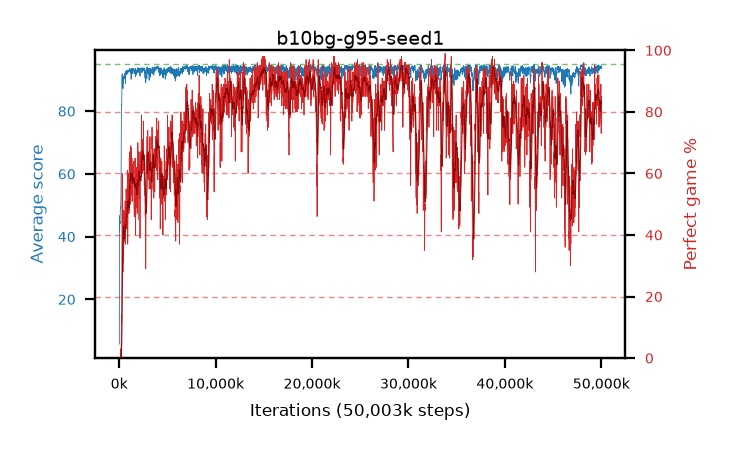

# b10bg-g95-seed1

step **50,003,968** · 3052 evals · trailing **93.85** · peak **94.26** @29,605,888 · sef **57.1** · best30 **93.6** @15,171,584

## Config

| | |
|---|---|
| algo | ppo |
| collect_envs | 128 |
| discount | 0.95 |
| eval_interval | 16384 |
| eval_queue | True |
| eval_queue_depth | 16 |
| eval_workers | 8 |
| fc_layers | (320,) |
| graph_eval_episodes | 100 |
| max_steps | 50003968 |
| min_checkpoint_score | 40.0 |
| ppo_adam_epsilon | 1e-07 |
| ppo_clip | 0.2 |
| ppo_clip_final | None |
| ppo_entropy_coef | 0.01 |
| ppo_entropy_coef_final | None |
| ppo_epochs | 4 |
| ppo_gae_lambda | 0.98 |
| ppo_gradient_clipping | 0.5 |
| ppo_horizon | 14.5 |
| ppo_learning_rate | 0.0003 |
| ppo_learning_rate_final | None |
| ppo_minibatch | 256 |
| ppo_normalize_adv | True |
| ppo_rollout | 128 |
| ppo_target_kl | 0.0 |
| ppo_transitions_per_rollout | 16384 |
| ppo_value_loss | huber |
| ppo_vf_coef | 0.5 |
| seed | 1 |
| torch_threads | 1 |

## Evals

| step | avg score | trailing avg | min score | max score | avg reward | perfect % | epsilon |
|---|---|---|---|---|---|---|---|
| 16384 | 5.73 | 5.73 | 0.0 | 19.0 | 5.14 | 0.0 |  |
| 32768 | 46.64 | 36.63 | 0.0 | 85.0 | 42.225 | 0.0 |  |
| 49152 | 41.77 | 23.75 | 15.0 | 81.0 | 36.995 | 0.0 |  |
| ... | ... | ... | ... | ... | ... | ... | ... |
| 49823744 | 94.02 | 93.8 | 80.0 | 95.0 | 174.115 | 81.0 |  |
| 49840128 | 93.49 | 93.79 | 80.0 | 95.0 | 168.61 | 76.0 |  |
| 49856512 | 94.29 | 93.82 | 87.0 | 95.0 | 177.37 | 84.0 |  |
| 49872896 | 93.84 | 93.85 | 83.0 | 95.0 | 170.95 | 78.0 |  |
| 49889280 | 94.1 | 93.89 | 80.0 | 95.0 | 177.18 | 84.0 |  |
| 49905664 | 93.82 | 93.83 | 78.0 | 95.0 | 175.86 | 83.0 |  |
| 49922048 | 94.01 | 93.86 | 75.0 | 95.0 | 177.09 | 84.0 |  |
| 49938432 | 94.26 | 93.78 | 80.0 | 95.0 | 180.28 | 87.0 |  |
| 49954816 | 94.47 | 93.78 | 75.0 | 95.0 | 182.525 | 89.0 |  |
| 49971200 | 94.34 | 93.8 | 80.0 | 95.0 | 181.4 | 88.0 |  |
| 49987584 | 93.51 | 93.84 | 46.0 | 95.0 | 165.6 | 73.0 |  |
| 50003968 | 94.46 | 93.85 | 88.0 | 95.0 | 178.49 | 85.0 |  |
