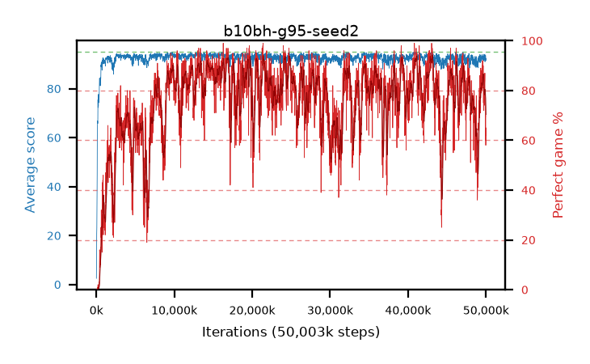

# b10bh-g95-seed2

step **50,003,968** · 3052 evals · trailing **92.93** · peak **94.43** @40,927,232 · sef **49.4** · best30 **92.7** @43,171,840

## Config

| | |
|---|---|
| algo | ppo |
| collect_envs | 128 |
| discount | 0.95 |
| eval_interval | 16384 |
| eval_queue | True |
| eval_queue_depth | 16 |
| eval_workers | 8 |
| fc_layers | (320,) |
| graph_eval_episodes | 100 |
| max_steps | 50003968 |
| min_checkpoint_score | 40.0 |
| ppo_adam_epsilon | 1e-07 |
| ppo_clip | 0.2 |
| ppo_clip_final | None |
| ppo_entropy_coef | 0.01 |
| ppo_entropy_coef_final | None |
| ppo_epochs | 4 |
| ppo_gae_lambda | 0.98 |
| ppo_gradient_clipping | 0.5 |
| ppo_horizon | 14.5 |
| ppo_learning_rate | 0.0003 |
| ppo_learning_rate_final | None |
| ppo_minibatch | 256 |
| ppo_normalize_adv | True |
| ppo_rollout | 128 |
| ppo_target_kl | 0.0 |
| ppo_transitions_per_rollout | 16384 |
| ppo_value_loss | huber |
| ppo_vf_coef | 0.5 |
| seed | 2 |
| torch_threads | 1 |

## Evals

| step | avg score | trailing avg | min score | max score | avg reward | perfect % | epsilon |
|---|---|---|---|---|---|---|---|
| 16384 | 2.51 | 2.51 | 0.0 | 7.0 | -1.365 | 0.0 |  |
| 32768 | 9.06 | 5.79 | 0.0 | 20.0 | 4.375 | 0.0 |  |
| 49152 | 20.82 | 10.8 | 0.0 | 39.0 | 16.225 | 0.0 |  |
| ... | ... | ... | ... | ... | ... | ... | ... |
| 49823744 | 93.52 | 92.86 | 48.0 | 95.0 | 175.56 | 83.0 |  |
| 49840128 | 93.58 | 92.95 | 48.0 | 95.0 | 176.615 | 84.0 |  |
| 49856512 | 93.94 | 93.04 | 63.0 | 95.0 | 180.005 | 87.0 |  |
| 49872896 | 91.0 | 92.96 | 3.0 | 95.0 | 169.06 | 79.0 |  |
| 49889280 | 93.59 | 92.86 | 65.0 | 95.0 | 170.7 | 78.0 |  |
| 49905664 | 93.14 | 92.98 | 45.0 | 95.0 | 167.265 | 75.0 |  |
| 49922048 | 92.72 | 92.92 | 62.0 | 95.0 | 151.92 | 60.0 |  |
| 49938432 | 93.6 | 92.81 | 71.0 | 95.0 | 161.755 | 69.0 |  |
| 49954816 | 93.19 | 93.05 | 57.0 | 95.0 | 162.295 | 70.0 |  |
| 49971200 | 91.45 | 92.97 | 21.0 | 95.0 | 148.66 | 58.0 |  |
| 49987584 | 92.23 | 93.02 | 36.0 | 95.0 | 156.36 | 65.0 |  |
| 50003968 | 92.36 | 92.93 | 14.0 | 95.0 | 153.55 | 62.0 |  |
