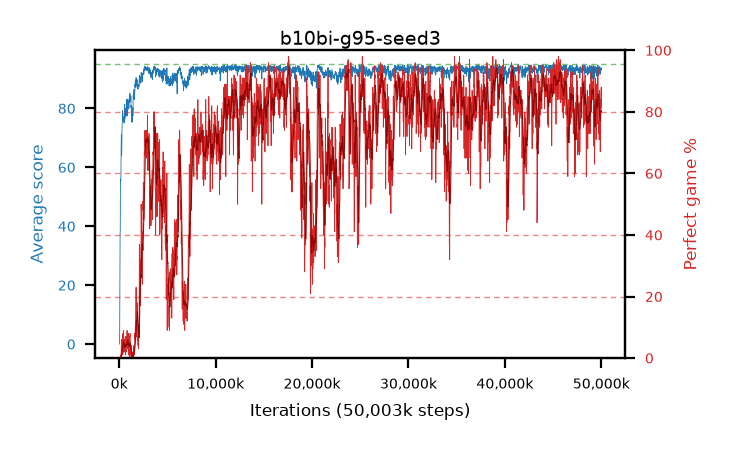

# b10bi-g95-seed3

step **50,003,968** · 3052 evals · trailing **92.98** · peak **94.16** @45,547,520 · sef **46.7** · best30 **91.6** @39,190,528

## Config

| | |
|---|---|
| algo | ppo |
| collect_envs | 128 |
| discount | 0.95 |
| eval_interval | 16384 |
| eval_queue | True |
| eval_queue_depth | 16 |
| eval_workers | 8 |
| fc_layers | (320,) |
| graph_eval_episodes | 100 |
| max_steps | 50003968 |
| min_checkpoint_score | 40.0 |
| ppo_adam_epsilon | 1e-07 |
| ppo_clip | 0.2 |
| ppo_clip_final | None |
| ppo_entropy_coef | 0.01 |
| ppo_entropy_coef_final | None |
| ppo_epochs | 4 |
| ppo_gae_lambda | 0.98 |
| ppo_gradient_clipping | 0.5 |
| ppo_horizon | 14.5 |
| ppo_learning_rate | 0.0003 |
| ppo_learning_rate_final | None |
| ppo_minibatch | 256 |
| ppo_normalize_adv | True |
| ppo_rollout | 128 |
| ppo_target_kl | 0.0 |
| ppo_transitions_per_rollout | 16384 |
| ppo_value_loss | huber |
| ppo_vf_coef | 0.5 |
| seed | 3 |
| torch_threads | 1 |

## Evals

| step | avg score | trailing avg | min score | max score | avg reward | perfect % | epsilon |
|---|---|---|---|---|---|---|---|
| 16384 | 0.0 | 0.0 | 0.0 | 0.0 | -4.55 | 0.0 |  |
| 32768 | 0.76 | 0.38 | 0.0 | 4.0 | 0.26 | 0.0 |  |
| 49152 | 2.55 | 1.1 | 0.0 | 17.0 | 1.78 | 0.0 |  |
| ... | ... | ... | ... | ... | ... | ... | ... |
| 49823744 | 93.3 | 93.02 | 35.0 | 95.0 | 179.365 | 87.0 |  |
| 49840128 | 94.22 | 92.97 | 70.0 | 95.0 | 179.29 | 86.0 |  |
| 49856512 | 91.94 | 92.97 | 10.0 | 95.0 | 170.0 | 79.0 |  |
| 49872896 | 92.25 | 93.05 | 14.0 | 95.0 | 170.31 | 79.0 |  |
| 49889280 | 91.96 | 93.08 | 52.0 | 95.0 | 157.99 | 67.0 |  |
| 49905664 | 91.61 | 92.95 | 19.0 | 95.0 | 165.735 | 75.0 |  |
| 49922048 | 93.49 | 93.04 | 71.0 | 95.0 | 175.575 | 83.0 |  |
| 49938432 | 92.73 | 93.09 | 26.0 | 95.0 | 174.77 | 83.0 |  |
| 49954816 | 93.16 | 92.93 | 45.0 | 95.0 | 176.24 | 84.0 |  |
| 49971200 | 93.79 | 93.01 | 50.0 | 95.0 | 173.885 | 81.0 |  |
| 49987584 | 93.58 | 93.03 | 19.0 | 95.0 | 180.64 | 88.0 |  |
| 50003968 | 93.06 | 92.98 | 13.0 | 95.0 | 174.15 | 82.0 |  |
