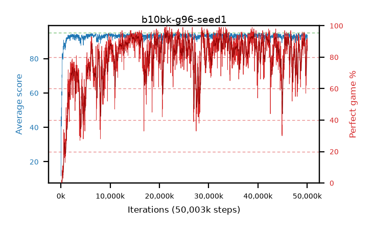

# b10bk-g96-seed1

step **50,003,968** · 3052 evals · trailing **92.9** · peak **94.44** @32,407,552 · sef **63.4** · best30 **95.0** @21,643,264

## Config

| | |
|---|---|
| algo | ppo |
| collect_envs | 128 |
| discount | 0.96 |
| eval_interval | 16384 |
| eval_queue | True |
| eval_queue_depth | 16 |
| eval_workers | 8 |
| fc_layers | (320,) |
| graph_eval_episodes | 100 |
| max_steps | 50003968 |
| min_checkpoint_score | 40.0 |
| ppo_adam_epsilon | 1e-07 |
| ppo_clip | 0.2 |
| ppo_clip_final | None |
| ppo_entropy_coef | 0.01 |
| ppo_entropy_coef_final | None |
| ppo_epochs | 4 |
| ppo_gae_lambda | 0.98 |
| ppo_gradient_clipping | 0.5 |
| ppo_horizon | 16.9 |
| ppo_learning_rate | 0.0003 |
| ppo_learning_rate_final | None |
| ppo_minibatch | 256 |
| ppo_normalize_adv | True |
| ppo_rollout | 128 |
| ppo_target_kl | 0.0 |
| ppo_transitions_per_rollout | 16384 |
| ppo_value_loss | huber |
| ppo_vf_coef | 0.5 |
| seed | 1 |
| torch_threads | 1 |

## Evals

| step | avg score | trailing avg | min score | max score | avg reward | perfect % | epsilon |
|---|---|---|---|---|---|---|---|
| 16384 | 11.78 | 11.78 | 0.0 | 31.0 | 10.92 | 0.0 |  |
| 32768 | 42.45 | 36.66 | 9.0 | 86.0 | 37.765 | 0.0 |  |
| 49152 | 42.16 | 31.53 | 5.0 | 76.0 | 37.385 | 0.0 |  |
| ... | ... | ... | ... | ... | ... | ... | ... |
| 49823744 | 93.57 | 93.19 | 30.0 | 95.0 | 177.51 | 85.0 |  |
| 49840128 | 92.86 | 93.32 | 33.0 | 95.0 | 176.845 | 85.0 |  |
| 49856512 | 94.27 | 93.17 | 63.0 | 95.0 | 184.315 | 91.0 |  |
| 49872896 | 93.55 | 93.2 | 35.0 | 95.0 | 180.61 | 88.0 |  |
| 49889280 | 93.7 | 93.01 | 57.0 | 95.0 | 182.705 | 90.0 |  |
| 49905664 | 92.77 | 92.95 | 45.0 | 95.0 | 174.72 | 83.0 |  |
| 49922048 | 91.93 | 93.12 | 20.0 | 95.0 | 172.975 | 82.0 |  |
| 49938432 | 93.4 | 92.92 | 37.0 | 95.0 | 179.465 | 87.0 |  |
| 49954816 | 93.57 | 93.14 | 57.0 | 95.0 | 182.53 | 90.0 |  |
| 49971200 | 91.47 | 93.02 | 16.0 | 95.0 | 174.46 | 84.0 |  |
| 49987584 | 93.55 | 92.92 | 2.0 | 95.0 | 184.59 | 92.0 |  |
| 50003968 | 93.78 | 92.9 | 74.0 | 95.0 | 177.81 | 85.0 |  |
