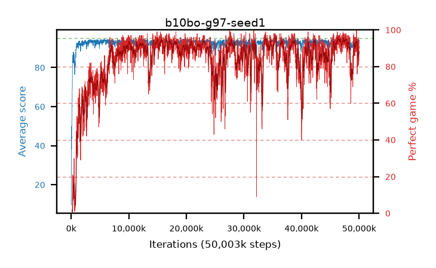

# b10bo-g97-seed1

step **50,003,968** · 3052 evals · trailing **93.82** · peak **94.14** @38,748,160 · sef **75.0** · best30 **94.8** @46,694,400

## Config

| | |
|---|---|
| algo | ppo |
| collect_envs | 128 |
| discount | 0.97 |
| eval_interval | 16384 |
| eval_queue | True |
| eval_queue_depth | 16 |
| eval_workers | 8 |
| fc_layers | (320,) |
| graph_eval_episodes | 100 |
| max_steps | 50003968 |
| min_checkpoint_score | 40.0 |
| ppo_adam_epsilon | 1e-07 |
| ppo_clip | 0.2 |
| ppo_clip_final | None |
| ppo_entropy_coef | 0.01 |
| ppo_entropy_coef_final | None |
| ppo_epochs | 4 |
| ppo_gae_lambda | 0.98 |
| ppo_gradient_clipping | 0.5 |
| ppo_horizon | 20.2 |
| ppo_learning_rate | 0.0003 |
| ppo_learning_rate_final | None |
| ppo_minibatch | 256 |
| ppo_normalize_adv | True |
| ppo_rollout | 128 |
| ppo_target_kl | 0.0 |
| ppo_transitions_per_rollout | 16384 |
| ppo_value_loss | huber |
| ppo_vf_coef | 0.5 |
| seed | 1 |
| torch_threads | 1 |

## Evals

| step | avg score | trailing avg | min score | max score | avg reward | perfect % | epsilon |
|---|---|---|---|---|---|---|---|
| 16384 | 9.63 | 9.63 | 0.0 | 29.0 | 8.455 | 0.0 |  |
| 32768 | 49.89 | 37.62 | 20.0 | 91.0 | 45.16 | 0.0 |  |
| 49152 | 39.73 | 33.01 | 13.0 | 78.0 | 34.775 | 0.0 |  |
| ... | ... | ... | ... | ... | ... | ... | ... |
| 49823744 | 93.7 | 93.89 | 75.0 | 95.0 | 177.775 | 85.0 |  |
| 49840128 | 94.78 | 93.92 | 84.0 | 95.0 | 189.8 | 96.0 |  |
| 49856512 | 93.81 | 93.91 | 70.0 | 95.0 | 180.87 | 88.0 |  |
| 49872896 | 93.84 | 93.85 | 22.0 | 95.0 | 186.87 | 94.0 |  |
| 49889280 | 94.35 | 93.96 | 80.0 | 95.0 | 181.365 | 88.0 |  |
| 49905664 | 93.07 | 93.85 | 73.0 | 95.0 | 173.165 | 81.0 |  |
| 49922048 | 94.43 | 93.89 | 81.0 | 95.0 | 181.49 | 88.0 |  |
| 49938432 | 92.36 | 93.81 | 8.0 | 95.0 | 176.435 | 85.0 |  |
| 49954816 | 92.33 | 93.71 | 14.0 | 95.0 | 174.415 | 83.0 |  |
| 49971200 | 94.18 | 93.79 | 69.0 | 95.0 | 184.225 | 91.0 |  |
| 49987584 | 93.88 | 93.89 | 71.0 | 95.0 | 182.93 | 90.0 |  |
| 50003968 | 93.76 | 93.82 | 7.0 | 95.0 | 186.79 | 94.0 |  |
