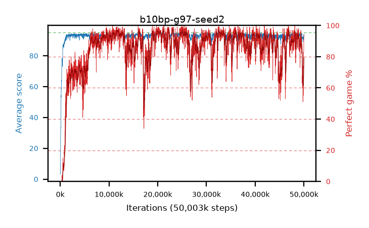

# b10bp-g97-seed2

step **50,003,968** · 3052 evals · trailing **92.46** · peak **94.58** @46,891,008 · sef **77.0** · best30 **96.4** @11,894,784

## Config

| | |
|---|---|
| algo | ppo |
| collect_envs | 128 |
| discount | 0.97 |
| eval_interval | 16384 |
| eval_queue | True |
| eval_queue_depth | 16 |
| eval_workers | 8 |
| fc_layers | (320,) |
| graph_eval_episodes | 100 |
| max_steps | 50003968 |
| min_checkpoint_score | 40.0 |
| ppo_adam_epsilon | 1e-07 |
| ppo_clip | 0.2 |
| ppo_clip_final | None |
| ppo_entropy_coef | 0.01 |
| ppo_entropy_coef_final | None |
| ppo_epochs | 4 |
| ppo_gae_lambda | 0.98 |
| ppo_gradient_clipping | 0.5 |
| ppo_horizon | 20.2 |
| ppo_learning_rate | 0.0003 |
| ppo_learning_rate_final | None |
| ppo_minibatch | 256 |
| ppo_normalize_adv | True |
| ppo_rollout | 128 |
| ppo_target_kl | 0.0 |
| ppo_transitions_per_rollout | 16384 |
| ppo_value_loss | huber |
| ppo_vf_coef | 0.5 |
| seed | 2 |
| torch_threads | 1 |

## Evals

| step | avg score | trailing avg | min score | max score | avg reward | perfect % | epsilon |
|---|---|---|---|---|---|---|---|
| 16384 | 3.09 | 3.09 | 0.0 | 8.0 | -0.92 | 0.0 |  |
| 32768 | 11.55 | 7.32 | 4.0 | 25.0 | 6.82 | 0.0 |  |
| 49152 | 24.58 | 16.7 | 7.0 | 40.0 | 19.58 | 0.0 |  |
| ... | ... | ... | ... | ... | ... | ... | ... |
| 49823744 | 89.99 | 93.22 | 16.0 | 95.0 | 155.885 | 67.0 |  |
| 49840128 | 91.05 | 93.05 | 71.0 | 95.0 | 149.165 | 59.0 |  |
| 49856512 | 90.99 | 92.66 | 74.0 | 95.0 | 145.215 | 55.0 |  |
| 49872896 | 90.54 | 92.47 | 67.0 | 95.0 | 148.7 | 59.0 |  |
| 49889280 | 92.75 | 92.41 | 69.0 | 95.0 | 174.835 | 83.0 |  |
| 49905664 | 90.92 | 92.2 | 68.0 | 95.0 | 163.055 | 73.0 |  |
| 49922048 | 92.17 | 92.93 | 50.0 | 95.0 | 172.175 | 81.0 |  |
| 49938432 | 91.86 | 92.77 | 10.0 | 95.0 | 173.855 | 83.0 |  |
| 49954816 | 92.97 | 93.01 | 72.0 | 95.0 | 175.01 | 83.0 |  |
| 49971200 | 93.54 | 92.62 | 61.0 | 95.0 | 182.545 | 90.0 |  |
| 49987584 | 93.36 | 92.46 | 22.0 | 95.0 | 184.4 | 92.0 |  |
| 50003968 | 94.1 | 92.46 | 74.0 | 95.0 | 187.13 | 94.0 |  |
