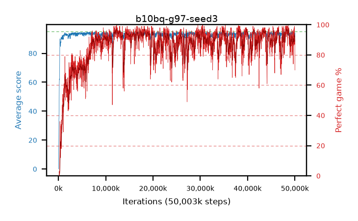

# b10bq-g97-seed3

step **50,003,968** · 3052 evals · trailing **93.84** · peak **94.37** @38,289,408 · sef **79.3** · best30 **96.2** @48,431,104

## Config

| | |
|---|---|
| algo | ppo |
| collect_envs | 128 |
| discount | 0.97 |
| eval_interval | 16384 |
| eval_queue | True |
| eval_queue_depth | 16 |
| eval_workers | 8 |
| fc_layers | (320,) |
| graph_eval_episodes | 100 |
| max_steps | 50003968 |
| min_checkpoint_score | 40.0 |
| ppo_adam_epsilon | 1e-07 |
| ppo_clip | 0.2 |
| ppo_clip_final | None |
| ppo_entropy_coef | 0.01 |
| ppo_entropy_coef_final | None |
| ppo_epochs | 4 |
| ppo_gae_lambda | 0.98 |
| ppo_gradient_clipping | 0.5 |
| ppo_horizon | 20.2 |
| ppo_learning_rate | 0.0003 |
| ppo_learning_rate_final | None |
| ppo_minibatch | 256 |
| ppo_normalize_adv | True |
| ppo_rollout | 128 |
| ppo_target_kl | 0.0 |
| ppo_transitions_per_rollout | 16384 |
| ppo_value_loss | huber |
| ppo_vf_coef | 0.5 |
| seed | 3 |
| torch_threads | 1 |

## Evals

| step | avg score | trailing avg | min score | max score | avg reward | perfect % | epsilon |
|---|---|---|---|---|---|---|---|
| 16384 | 0.03 | 0.03 | 0.0 | 1.0 | -2.27 | 0.0 |  |
| 32768 | 0.82 | 0.42 | 0.0 | 3.0 | 0.32 | 0.0 |  |
| 49152 | 15.68 | 9.0 | 3.0 | 29.0 | 10.95 | 0.0 |  |
| ... | ... | ... | ... | ... | ... | ... | ... |
| 49823744 | 94.95 | 93.86 | 92.0 | 95.0 | 191.96 | 98.0 |  |
| 49840128 | 94.78 | 93.86 | 78.0 | 95.0 | 191.79 | 98.0 |  |
| 49856512 | 93.65 | 93.83 | 32.0 | 95.0 | 185.685 | 93.0 |  |
| 49872896 | 94.35 | 93.84 | 70.0 | 95.0 | 187.38 | 94.0 |  |
| 49889280 | 93.02 | 93.8 | 56.0 | 95.0 | 181.075 | 89.0 |  |
| 49905664 | 94.75 | 93.84 | 70.0 | 95.0 | 192.755 | 99.0 |  |
| 49922048 | 93.06 | 93.8 | 12.0 | 95.0 | 180.12 | 88.0 |  |
| 49938432 | 93.52 | 93.86 | 22.0 | 95.0 | 185.555 | 93.0 |  |
| 49954816 | 92.77 | 93.8 | 22.0 | 95.0 | 178.835 | 87.0 |  |
| 49971200 | 93.55 | 93.82 | 34.0 | 95.0 | 179.615 | 87.0 |  |
| 49987584 | 94.18 | 93.9 | 75.0 | 95.0 | 183.23 | 90.0 |  |
| 50003968 | 91.58 | 93.84 | 24.0 | 95.0 | 160.73 | 70.0 |  |
