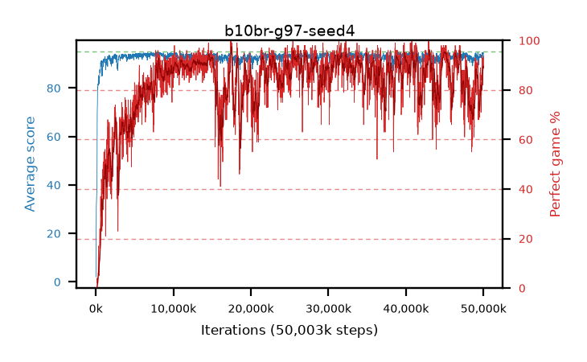

# b10br-g97-seed4

step **50,003,968** · 3052 evals · trailing **93.58** · peak **94.29** @46,694,400 · sef **71.0** · best30 **94.7** @45,187,072

## Config

| | |
|---|---|
| algo | ppo |
| collect_envs | 128 |
| discount | 0.97 |
| eval_interval | 16384 |
| eval_queue | True |
| eval_queue_depth | 16 |
| eval_workers | 8 |
| fc_layers | (320,) |
| graph_eval_episodes | 100 |
| max_steps | 50003968 |
| min_checkpoint_score | 40.0 |
| ppo_adam_epsilon | 1e-07 |
| ppo_clip | 0.2 |
| ppo_clip_final | None |
| ppo_entropy_coef | 0.01 |
| ppo_entropy_coef_final | None |
| ppo_epochs | 4 |
| ppo_gae_lambda | 0.98 |
| ppo_gradient_clipping | 0.5 |
| ppo_horizon | 20.2 |
| ppo_learning_rate | 0.0003 |
| ppo_learning_rate_final | None |
| ppo_minibatch | 256 |
| ppo_normalize_adv | True |
| ppo_rollout | 128 |
| ppo_target_kl | 0.0 |
| ppo_transitions_per_rollout | 16384 |
| ppo_value_loss | huber |
| ppo_vf_coef | 0.5 |
| seed | 4 |
| torch_threads | 1 |

## Evals

| step | avg score | trailing avg | min score | max score | avg reward | perfect % | epsilon |
|---|---|---|---|---|---|---|---|
| 16384 | 2.09 | 2.09 | 0.0 | 7.0 | 0.24 | 0.0 |  |
| 32768 | 12.55 | 18.2 | 1.0 | 26.0 | 8.585 | 0.0 |  |
| 49152 | 26.42 | 14.26 | 2.0 | 51.0 | 21.51 | 0.0 |  |
| ... | ... | ... | ... | ... | ... | ... | ... |
| 49823744 | 94.07 | 93.03 | 75.0 | 95.0 | 181.13 | 88.0 |  |
| 49840128 | 94.69 | 92.89 | 86.0 | 95.0 | 187.72 | 94.0 |  |
| 49856512 | 94.15 | 92.79 | 72.0 | 95.0 | 184.195 | 91.0 |  |
| 49872896 | 94.05 | 93.37 | 66.0 | 95.0 | 179.12 | 86.0 |  |
| 49889280 | 93.73 | 93.1 | 53.0 | 95.0 | 181.785 | 89.0 |  |
| 49905664 | 94.17 | 93.22 | 81.0 | 95.0 | 175.26 | 82.0 |  |
| 49922048 | 94.43 | 93.48 | 76.0 | 95.0 | 184.475 | 91.0 |  |
| 49938432 | 94.12 | 93.52 | 74.0 | 95.0 | 182.175 | 89.0 |  |
| 49954816 | 94.4 | 93.41 | 62.0 | 95.0 | 184.445 | 91.0 |  |
| 49971200 | 94.59 | 93.56 | 77.0 | 95.0 | 186.625 | 93.0 |  |
| 49987584 | 92.11 | 93.5 | 8.0 | 95.0 | 181.16 | 90.0 |  |
| 50003968 | 93.3 | 93.58 | 61.0 | 95.0 | 181.355 | 89.0 |  |
