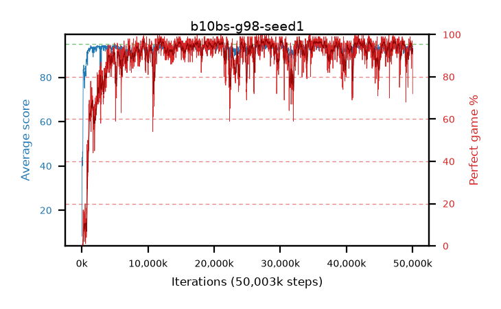

# b10bs-g98-seed1

step **50,003,968** · 3052 evals · trailing **93.61** · peak **94.38** @28,246,016 · sef **89.6** · best30 **97.1** @28,114,944

## Config

| | |
|---|---|
| algo | ppo |
| collect_envs | 128 |
| discount | 0.98 |
| eval_interval | 16384 |
| eval_queue | True |
| eval_queue_depth | 16 |
| eval_workers | 8 |
| fc_layers | (320,) |
| graph_eval_episodes | 100 |
| max_steps | 50003968 |
| min_checkpoint_score | 40.0 |
| ppo_adam_epsilon | 1e-07 |
| ppo_clip | 0.2 |
| ppo_clip_final | None |
| ppo_entropy_coef | 0.01 |
| ppo_entropy_coef_final | None |
| ppo_epochs | 4 |
| ppo_gae_lambda | 0.98 |
| ppo_gradient_clipping | 0.5 |
| ppo_horizon | 25.3 |
| ppo_learning_rate | 0.0003 |
| ppo_learning_rate_final | None |
| ppo_minibatch | 256 |
| ppo_normalize_adv | True |
| ppo_rollout | 128 |
| ppo_target_kl | 0.0 |
| ppo_transitions_per_rollout | 16384 |
| ppo_value_loss | huber |
| ppo_vf_coef | 0.5 |
| seed | 1 |
| torch_threads | 1 |

## Evals

| step | avg score | trailing avg | min score | max score | avg reward | perfect % | epsilon |
|---|---|---|---|---|---|---|---|
| 16384 | 8.21 | 8.21 | 0.0 | 22.0 | 7.305 | 0.0 |  |
| 32768 | 43.75 | 38.58 | 16.0 | 91.0 | 38.795 | 0.0 |  |
| 49152 | 41.97 | 33.21 | 11.0 | 80.0 | 37.015 | 0.0 |  |
| ... | ... | ... | ... | ... | ... | ... | ... |
| 49823744 | 93.4 | 93.26 | 69.0 | 95.0 | 176.48 | 84.0 |  |
| 49840128 | 93.47 | 93.4 | 62.0 | 95.0 | 178.54 | 86.0 |  |
| 49856512 | 94.86 | 93.48 | 90.0 | 95.0 | 189.88 | 96.0 |  |
| 49872896 | 94.39 | 93.69 | 66.0 | 95.0 | 188.415 | 95.0 |  |
| 49889280 | 93.16 | 93.74 | 3.0 | 95.0 | 188.18 | 96.0 |  |
| 49905664 | 94.64 | 93.77 | 75.0 | 95.0 | 190.655 | 97.0 |  |
| 49922048 | 94.01 | 93.71 | 5.0 | 95.0 | 189.03 | 96.0 |  |
| 49938432 | 94.34 | 93.64 | 79.0 | 95.0 | 184.385 | 91.0 |  |
| 49954816 | 93.95 | 93.71 | 51.0 | 95.0 | 185.94 | 93.0 |  |
| 49971200 | 94.3 | 93.67 | 75.0 | 95.0 | 186.335 | 93.0 |  |
| 49987584 | 93.28 | 93.69 | 8.0 | 95.0 | 184.32 | 92.0 |  |
| 50003968 | 90.41 | 93.61 | 1.0 | 95.0 | 161.55 | 72.0 |  |
