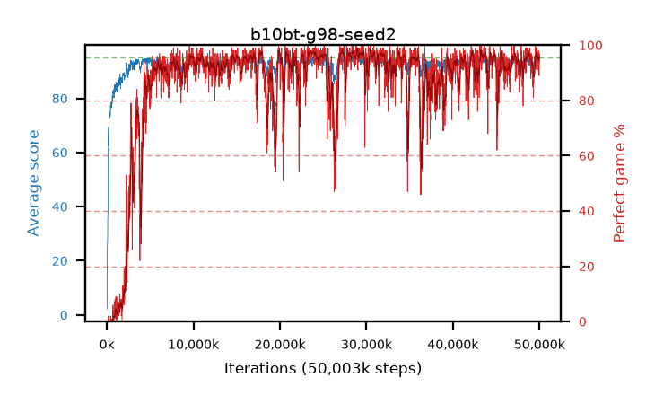

# b10bt-g98-seed2

step **50,003,968** · 3052 evals · trailing **93.58** · peak **94.37** @29,278,208 · sef **84.7** · best30 **97.5** @23,855,104

## Config

| | |
|---|---|
| algo | ppo |
| collect_envs | 128 |
| discount | 0.98 |
| eval_interval | 16384 |
| eval_queue | True |
| eval_queue_depth | 16 |
| eval_workers | 8 |
| fc_layers | (320,) |
| graph_eval_episodes | 100 |
| max_steps | 50003968 |
| min_checkpoint_score | 40.0 |
| ppo_adam_epsilon | 1e-07 |
| ppo_clip | 0.2 |
| ppo_clip_final | None |
| ppo_entropy_coef | 0.01 |
| ppo_entropy_coef_final | None |
| ppo_epochs | 4 |
| ppo_gae_lambda | 0.98 |
| ppo_gradient_clipping | 0.5 |
| ppo_horizon | 25.3 |
| ppo_learning_rate | 0.0003 |
| ppo_learning_rate_final | None |
| ppo_minibatch | 256 |
| ppo_normalize_adv | True |
| ppo_rollout | 128 |
| ppo_target_kl | 0.0 |
| ppo_transitions_per_rollout | 16384 |
| ppo_value_loss | huber |
| ppo_vf_coef | 0.5 |
| seed | 2 |
| torch_threads | 1 |

## Evals

| step | avg score | trailing avg | min score | max score | avg reward | perfect % | epsilon |
|---|---|---|---|---|---|---|---|
| 16384 | 2.2 | 2.2 | 0.0 | 5.0 | -1.27 | 0.0 |  |
| 32768 | 14.38 | 8.29 | 4.0 | 27.0 | 9.56 | 0.0 |  |
| 49152 | 25.35 | 17.04 | 6.0 | 46.0 | 20.35 | 0.0 |  |
| ... | ... | ... | ... | ... | ... | ... | ... |
| 49823744 | 94.05 | 93.48 | 40.0 | 95.0 | 187.08 | 94.0 |  |
| 49840128 | 93.39 | 93.53 | 48.0 | 95.0 | 186.42 | 94.0 |  |
| 49856512 | 94.37 | 93.55 | 68.0 | 95.0 | 188.395 | 95.0 |  |
| 49872896 | 94.95 | 93.56 | 92.0 | 95.0 | 191.96 | 98.0 |  |
| 49889280 | 93.54 | 93.52 | 28.0 | 95.0 | 187.565 | 95.0 |  |
| 49905664 | 93.73 | 93.55 | 15.0 | 95.0 | 187.71 | 95.0 |  |
| 49922048 | 94.35 | 93.63 | 66.0 | 95.0 | 190.365 | 97.0 |  |
| 49938432 | 92.95 | 93.58 | 5.0 | 95.0 | 187.97 | 96.0 |  |
| 49954816 | 92.85 | 93.55 | 9.0 | 95.0 | 180.86 | 89.0 |  |
| 49971200 | 93.88 | 93.59 | 12.0 | 95.0 | 189.85 | 97.0 |  |
| 49987584 | 94.38 | 93.58 | 64.0 | 95.0 | 190.395 | 97.0 |  |
| 50003968 | 93.71 | 93.58 | 12.0 | 95.0 | 188.73 | 96.0 |  |
