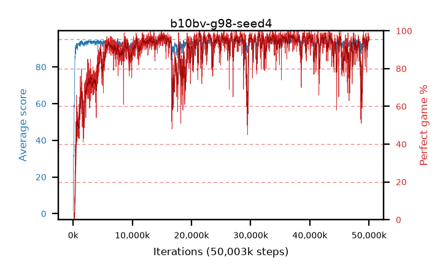

# b10bv-g98-seed4

step **50,003,968** · 3052 evals · trailing **93.86** · peak **94.33** @23,101,440 · sef **84.4** · best30 **97.2** @37,027,840

## Config

| | |
|---|---|
| algo | ppo |
| collect_envs | 128 |
| discount | 0.98 |
| eval_interval | 16384 |
| eval_queue | True |
| eval_queue_depth | 16 |
| eval_workers | 8 |
| fc_layers | (320,) |
| graph_eval_episodes | 100 |
| max_steps | 50003968 |
| min_checkpoint_score | 40.0 |
| ppo_adam_epsilon | 1e-07 |
| ppo_clip | 0.2 |
| ppo_clip_final | None |
| ppo_entropy_coef | 0.01 |
| ppo_entropy_coef_final | None |
| ppo_epochs | 4 |
| ppo_gae_lambda | 0.98 |
| ppo_gradient_clipping | 0.5 |
| ppo_horizon | 25.3 |
| ppo_learning_rate | 0.0003 |
| ppo_learning_rate_final | None |
| ppo_minibatch | 256 |
| ppo_normalize_adv | True |
| ppo_rollout | 128 |
| ppo_target_kl | 0.0 |
| ppo_transitions_per_rollout | 16384 |
| ppo_value_loss | huber |
| ppo_vf_coef | 0.5 |
| seed | 4 |
| torch_threads | 1 |

## Evals

| step | avg score | trailing avg | min score | max score | avg reward | perfect % | epsilon |
|---|---|---|---|---|---|---|---|
| 16384 | 1.41 | 1.41 | 0.0 | 6.0 | -0.71 | 0.0 |  |
| 32768 | 23.52 | 23.65 | 1.0 | 42.0 | 18.88 | 0.0 |  |
| 49152 | 30.24 | 21.14 | 10.0 | 50.0 | 25.24 | 0.0 |  |
| ... | ... | ... | ... | ... | ... | ... | ... |
| 49823744 | 94.21 | 93.55 | 58.0 | 95.0 | 187.195 | 94.0 |  |
| 49840128 | 94.67 | 93.9 | 85.0 | 95.0 | 186.66 | 93.0 |  |
| 49856512 | 94.84 | 93.91 | 79.0 | 95.0 | 192.845 | 99.0 |  |
| 49872896 | 94.89 | 93.75 | 92.0 | 95.0 | 189.91 | 96.0 |  |
| 49889280 | 94.62 | 93.46 | 75.0 | 95.0 | 190.635 | 97.0 |  |
| 49905664 | 94.62 | 93.89 | 65.0 | 95.0 | 191.63 | 98.0 |  |
| 49922048 | 93.99 | 93.86 | 36.0 | 95.0 | 188.015 | 95.0 |  |
| 49938432 | 93.8 | 93.86 | 6.0 | 95.0 | 187.825 | 95.0 |  |
| 49954816 | 94.21 | 93.91 | 38.0 | 95.0 | 189.23 | 96.0 |  |
| 49971200 | 94.74 | 93.82 | 81.0 | 95.0 | 190.755 | 97.0 |  |
| 49987584 | 94.63 | 93.9 | 66.0 | 95.0 | 190.6 | 97.0 |  |
| 50003968 | 94.35 | 93.86 | 59.0 | 95.0 | 188.375 | 95.0 |  |
