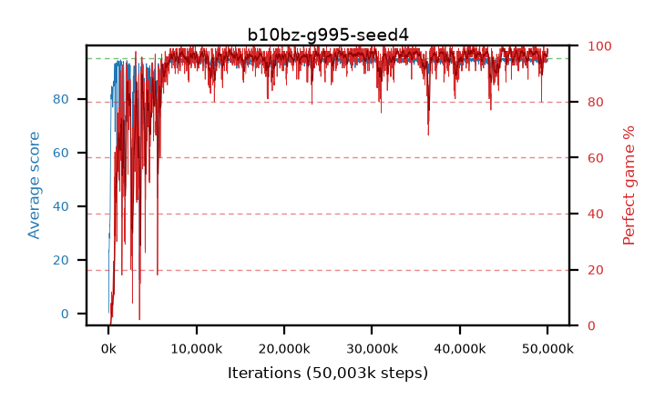

# b10bz-g995-seed4

step **50,003,968** · 3052 evals · trailing **94.31** · peak **94.62** @45,154,304 · sef **91.5** · best30 **98.3** @45,154,304

## Config

| | |
|---|---|
| algo | ppo |
| collect_envs | 128 |
| discount | 0.995 |
| eval_interval | 16384 |
| eval_queue | True |
| eval_queue_depth | 16 |
| eval_workers | 8 |
| fc_layers | (320,) |
| graph_eval_episodes | 100 |
| max_steps | 50003968 |
| min_checkpoint_score | 40.0 |
| ppo_adam_epsilon | 1e-07 |
| ppo_clip | 0.2 |
| ppo_clip_final | None |
| ppo_entropy_coef | 0.01 |
| ppo_entropy_coef_final | None |
| ppo_epochs | 4 |
| ppo_gae_lambda | 0.98 |
| ppo_gradient_clipping | 0.5 |
| ppo_horizon | 40.2 |
| ppo_learning_rate | 0.0003 |
| ppo_learning_rate_final | None |
| ppo_minibatch | 256 |
| ppo_normalize_adv | True |
| ppo_rollout | 128 |
| ppo_target_kl | 0.0 |
| ppo_transitions_per_rollout | 16384 |
| ppo_value_loss | huber |
| ppo_vf_coef | 0.5 |
| seed | 4 |
| torch_threads | 1 |

## Evals

| step | avg score | trailing avg | min score | max score | avg reward | perfect % | epsilon |
|---|---|---|---|---|---|---|---|
| 16384 | 0.26 | 0.26 | 0.0 | 4.0 | -0.51 | 0.0 |  |
| 32768 | 23.41 | 11.84 | 5.0 | 43.0 | 18.455 | 0.0 |  |
| 49152 | 23.05 | 15.57 | 4.0 | 44.0 | 18.05 | 0.0 |  |
| ... | ... | ... | ... | ... | ... | ... | ... |
| 49823744 | 93.66 | 93.76 | 27.0 | 95.0 | 188.635 | 96.0 |  |
| 49840128 | 94.77 | 94.24 | 86.0 | 95.0 | 190.785 | 97.0 |  |
| 49856512 | 93.63 | 94.23 | 10.0 | 95.0 | 188.605 | 96.0 |  |
| 49872896 | 94.12 | 94.31 | 16.0 | 95.0 | 191.13 | 98.0 |  |
| 49889280 | 94.2 | 94.19 | 34.0 | 95.0 | 191.21 | 98.0 |  |
| 49905664 | 94.72 | 94.26 | 73.0 | 95.0 | 191.73 | 98.0 |  |
| 49922048 | 94.81 | 94.24 | 76.0 | 95.0 | 192.815 | 99.0 |  |
| 49938432 | 94.35 | 94.3 | 70.0 | 95.0 | 190.365 | 97.0 |  |
| 49954816 | 93.79 | 94.3 | 24.0 | 95.0 | 188.765 | 96.0 |  |
| 49971200 | 94.17 | 94.31 | 12.0 | 95.0 | 192.175 | 99.0 |  |
| 49987584 | 94.8 | 94.32 | 75.0 | 95.0 | 192.805 | 99.0 |  |
| 50003968 | 94.88 | 94.31 | 86.0 | 95.0 | 191.89 | 98.0 |  |
