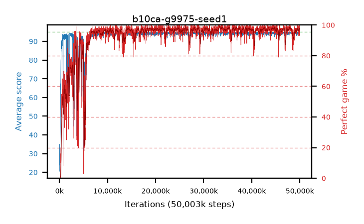

# b10ca-g9975-seed1

step **50,003,968** · 3052 evals · trailing **94.5** · peak **94.7** @33,439,744 · sef **91.5** · best30 **98.6** @33,669,120

## Config

| | |
|---|---|
| algo | ppo |
| collect_envs | 128 |
| discount | 0.9975 |
| eval_interval | 16384 |
| eval_queue | True |
| eval_queue_depth | 16 |
| eval_workers | 8 |
| fc_layers | (320,) |
| graph_eval_episodes | 100 |
| max_steps | 50003968 |
| min_checkpoint_score | 40.0 |
| ppo_adam_epsilon | 1e-07 |
| ppo_clip | 0.2 |
| ppo_clip_final | None |
| ppo_entropy_coef | 0.01 |
| ppo_entropy_coef_final | None |
| ppo_epochs | 4 |
| ppo_gae_lambda | 0.98 |
| ppo_gradient_clipping | 0.5 |
| ppo_horizon | 44.5 |
| ppo_learning_rate | 0.0003 |
| ppo_learning_rate_final | None |
| ppo_minibatch | 256 |
| ppo_normalize_adv | True |
| ppo_rollout | 128 |
| ppo_target_kl | 0.0 |
| ppo_transitions_per_rollout | 16384 |
| ppo_value_loss | huber |
| ppo_vf_coef | 0.5 |
| seed | 1 |
| torch_threads | 1 |

## Evals

| step | avg score | trailing avg | min score | max score | avg reward | perfect % | epsilon |
|---|---|---|---|---|---|---|---|
| 16384 | 20.53 | 22.29 | 4.0 | 43.0 | 17.24 | 0.0 |  |
| 32768 | 34.99 | 26.17 | 9.0 | 76.0 | 29.99 | 0.0 |  |
| 49152 | 24.04 | 24.04 | 5.0 | 43.0 | 19.085 | 0.0 |  |
| ... | ... | ... | ... | ... | ... | ... | ... |
| 49823744 | 94.08 | 94.52 | 32.0 | 95.0 | 189.055 | 96.0 |  |
| 49840128 | 94.87 | 94.54 | 85.0 | 95.0 | 191.88 | 98.0 |  |
| 49856512 | 94.39 | 94.52 | 68.0 | 95.0 | 189.365 | 96.0 |  |
| 49872896 | 94.42 | 94.5 | 65.0 | 95.0 | 189.44 | 96.0 |  |
| 49889280 | 94.1 | 94.4 | 16.0 | 95.0 | 191.11 | 98.0 |  |
| 49905664 | 94.62 | 94.4 | 62.0 | 95.0 | 191.63 | 98.0 |  |
| 49922048 | 94.72 | 94.42 | 78.0 | 95.0 | 191.73 | 98.0 |  |
| 49938432 | 95.0 | 94.47 | 95.0 | 95.0 | 194.0 | 100.0 |  |
| 49954816 | 93.42 | 94.43 | 8.0 | 95.0 | 186.405 | 94.0 |  |
| 49971200 | 93.31 | 94.47 | 12.0 | 95.0 | 185.345 | 93.0 |  |
| 49987584 | 94.72 | 94.49 | 76.0 | 95.0 | 191.73 | 98.0 |  |
| 50003968 | 94.09 | 94.5 | 74.0 | 95.0 | 187.12 | 94.0 |  |
