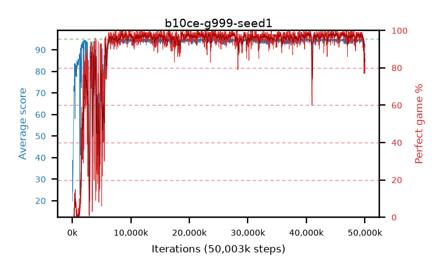

# b10ce-g999-seed1

step **50,003,968** · 3052 evals · trailing **93.12** · peak **94.67** @24,428,544 · sef **90.7** · best30 **98.2** @21,774,336

## Config

| | |
|---|---|
| algo | ppo |
| collect_envs | 128 |
| discount | 0.999 |
| eval_interval | 16384 |
| eval_queue | True |
| eval_queue_depth | 16 |
| eval_workers | 8 |
| fc_layers | (320,) |
| graph_eval_episodes | 100 |
| max_steps | 50003968 |
| min_checkpoint_score | 40.0 |
| ppo_adam_epsilon | 1e-07 |
| ppo_clip | 0.2 |
| ppo_clip_final | None |
| ppo_entropy_coef | 0.01 |
| ppo_entropy_coef_final | None |
| ppo_epochs | 4 |
| ppo_gae_lambda | 0.98 |
| ppo_gradient_clipping | 0.5 |
| ppo_horizon | 47.7 |
| ppo_learning_rate | 0.0003 |
| ppo_learning_rate_final | None |
| ppo_minibatch | 256 |
| ppo_normalize_adv | True |
| ppo_rollout | 128 |
| ppo_target_kl | 0.0 |
| ppo_transitions_per_rollout | 16384 |
| ppo_value_loss | huber |
| ppo_vf_coef | 0.5 |
| seed | 1 |
| torch_threads | 1 |

## Evals

| step | avg score | trailing avg | min score | max score | avg reward | perfect % | epsilon |
|---|---|---|---|---|---|---|---|
| 16384 | 19.8 | 23.12 | 3.0 | 43.0 | 16.06 | 0.0 |  |
| 32768 | 38.78 | 27.91 | 15.0 | 68.0 | 33.87 | 0.0 |  |
| 49152 | 26.44 | 26.44 | 3.0 | 55.0 | 21.62 | 0.0 |  |
| ... | ... | ... | ... | ... | ... | ... | ... |
| 49823744 | 94.07 | 93.88 | 80.0 | 95.0 | 183.12 | 90.0 |  |
| 49840128 | 91.84 | 94.03 | 70.0 | 95.0 | 167.955 | 77.0 |  |
| 49856512 | 92.96 | 93.79 | 68.0 | 95.0 | 177.035 | 85.0 |  |
| 49872896 | 94.23 | 93.83 | 76.0 | 95.0 | 186.22 | 93.0 |  |
| 49889280 | 92.66 | 93.75 | 20.0 | 95.0 | 180.715 | 89.0 |  |
| 49905664 | 92.18 | 93.69 | 10.0 | 95.0 | 176.21 | 85.0 |  |
| 49922048 | 91.15 | 93.57 | 61.0 | 95.0 | 168.26 | 78.0 |  |
| 49938432 | 92.09 | 93.48 | 70.0 | 95.0 | 171.19 | 80.0 |  |
| 49954816 | 92.6 | 93.42 | 64.0 | 95.0 | 176.675 | 85.0 |  |
| 49971200 | 91.0 | 93.31 | 62.0 | 95.0 | 167.115 | 77.0 |  |
| 49987584 | 91.39 | 93.2 | 20.0 | 95.0 | 173.475 | 83.0 |  |
| 50003968 | 92.71 | 93.12 | 67.0 | 95.0 | 179.77 | 88.0 |  |
