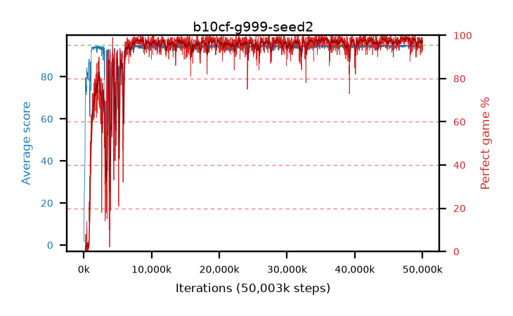

# b10cf-g999-seed2

step **50,003,968** · 3052 evals · trailing **94.25** · peak **94.75** @47,874,048 · sef **91.1** · best30 **98.6** @47,759,360

## Config

| | |
|---|---|
| algo | ppo |
| collect_envs | 128 |
| discount | 0.999 |
| eval_interval | 16384 |
| eval_queue | True |
| eval_queue_depth | 16 |
| eval_workers | 8 |
| fc_layers | (320,) |
| graph_eval_episodes | 100 |
| max_steps | 50003968 |
| min_checkpoint_score | 40.0 |
| ppo_adam_epsilon | 1e-07 |
| ppo_clip | 0.2 |
| ppo_clip_final | None |
| ppo_entropy_coef | 0.01 |
| ppo_entropy_coef_final | None |
| ppo_epochs | 4 |
| ppo_gae_lambda | 0.98 |
| ppo_gradient_clipping | 0.5 |
| ppo_horizon | 47.7 |
| ppo_learning_rate | 0.0003 |
| ppo_learning_rate_final | None |
| ppo_minibatch | 256 |
| ppo_normalize_adv | True |
| ppo_rollout | 128 |
| ppo_target_kl | 0.0 |
| ppo_transitions_per_rollout | 16384 |
| ppo_value_loss | huber |
| ppo_vf_coef | 0.5 |
| seed | 2 |
| torch_threads | 1 |

## Evals

| step | avg score | trailing avg | min score | max score | avg reward | perfect % | epsilon |
|---|---|---|---|---|---|---|---|
| 16384 | 1.63 | 1.63 | 0.0 | 5.0 | -0.985 | 0.0 |  |
| 32768 | 7.53 | 4.58 | 2.0 | 18.0 | 2.71 | 0.0 |  |
| 49152 | 11.34 | 6.83 | 2.0 | 32.0 | 6.34 | 0.0 |  |
| ... | ... | ... | ... | ... | ... | ... | ... |
| 49823744 | 94.81 | 94.34 | 76.0 | 95.0 | 192.815 | 99.0 |  |
| 49840128 | 94.61 | 94.31 | 56.0 | 95.0 | 192.615 | 99.0 |  |
| 49856512 | 94.84 | 94.29 | 84.0 | 95.0 | 191.85 | 98.0 |  |
| 49872896 | 93.86 | 94.29 | 64.0 | 95.0 | 184.9 | 92.0 |  |
| 49889280 | 94.8 | 94.31 | 82.0 | 95.0 | 191.81 | 98.0 |  |
| 49905664 | 93.77 | 94.28 | 10.0 | 95.0 | 190.78 | 98.0 |  |
| 49922048 | 94.13 | 94.26 | 8.0 | 95.0 | 192.135 | 99.0 |  |
| 49938432 | 94.64 | 94.25 | 65.0 | 95.0 | 191.65 | 98.0 |  |
| 49954816 | 94.63 | 94.26 | 58.0 | 95.0 | 192.635 | 99.0 |  |
| 49971200 | 93.68 | 94.3 | 24.0 | 95.0 | 187.705 | 95.0 |  |
| 49987584 | 94.23 | 94.31 | 71.0 | 95.0 | 186.22 | 93.0 |  |
| 50003968 | 93.5 | 94.25 | 15.0 | 95.0 | 187.435 | 95.0 |  |
