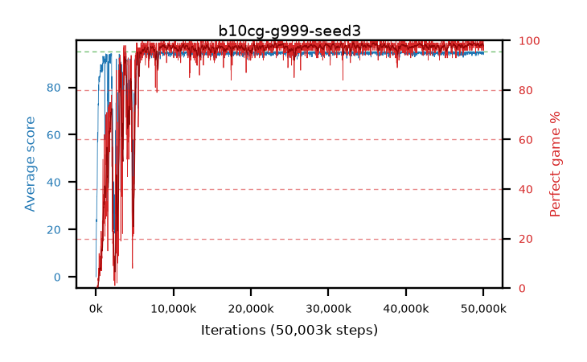

# b10cg-g999-seed3

step **50,003,968** · 3052 evals · trailing **94.61** · peak **94.76** @39,419,904 · sef **91.8** · best30 **98.7** @48,922,624

## Config

| | |
|---|---|
| algo | ppo |
| collect_envs | 128 |
| discount | 0.999 |
| eval_interval | 16384 |
| eval_queue | True |
| eval_queue_depth | 16 |
| eval_workers | 8 |
| fc_layers | (320,) |
| graph_eval_episodes | 100 |
| max_steps | 50003968 |
| min_checkpoint_score | 40.0 |
| ppo_adam_epsilon | 1e-07 |
| ppo_clip | 0.2 |
| ppo_clip_final | None |
| ppo_entropy_coef | 0.01 |
| ppo_entropy_coef_final | None |
| ppo_epochs | 4 |
| ppo_gae_lambda | 0.98 |
| ppo_gradient_clipping | 0.5 |
| ppo_horizon | 47.7 |
| ppo_learning_rate | 0.0003 |
| ppo_learning_rate_final | None |
| ppo_minibatch | 256 |
| ppo_normalize_adv | True |
| ppo_rollout | 128 |
| ppo_target_kl | 0.0 |
| ppo_transitions_per_rollout | 16384 |
| ppo_value_loss | huber |
| ppo_vf_coef | 0.5 |
| seed | 3 |
| torch_threads | 1 |

## Evals

| step | avg score | trailing avg | min score | max score | avg reward | perfect % | epsilon |
|---|---|---|---|---|---|---|---|
| 16384 | 0.05 | 0.05 | 0.0 | 1.0 | -3.6 | 0.0 |  |
| 32768 | 2.43 | 9.1 | 0.0 | 15.0 | 1.84 | 0.0 |  |
| 49152 | 15.24 | 11.32 | 0.0 | 31.0 | 10.555 | 0.0 |  |
| ... | ... | ... | ... | ... | ... | ... | ... |
| 49823744 | 95.0 | 94.58 | 95.0 | 95.0 | 194.0 | 100.0 |  |
| 49840128 | 94.29 | 94.56 | 24.0 | 95.0 | 192.295 | 99.0 |  |
| 49856512 | 94.98 | 94.57 | 93.0 | 95.0 | 192.985 | 99.0 |  |
| 49872896 | 94.08 | 94.51 | 10.0 | 95.0 | 190.095 | 97.0 |  |
| 49889280 | 94.98 | 94.56 | 93.0 | 95.0 | 192.985 | 99.0 |  |
| 49905664 | 94.34 | 94.57 | 58.0 | 95.0 | 191.305 | 98.0 |  |
| 49922048 | 94.28 | 94.63 | 52.0 | 95.0 | 189.255 | 96.0 |  |
| 49938432 | 94.91 | 94.63 | 86.0 | 95.0 | 192.915 | 99.0 |  |
| 49954816 | 95.0 | 94.61 | 95.0 | 95.0 | 194.0 | 100.0 |  |
| 49971200 | 93.74 | 94.6 | 48.0 | 95.0 | 188.67 | 96.0 |  |
| 49987584 | 94.71 | 94.61 | 77.0 | 95.0 | 191.72 | 98.0 |  |
| 50003968 | 94.46 | 94.61 | 78.0 | 95.0 | 189.48 | 96.0 |  |
