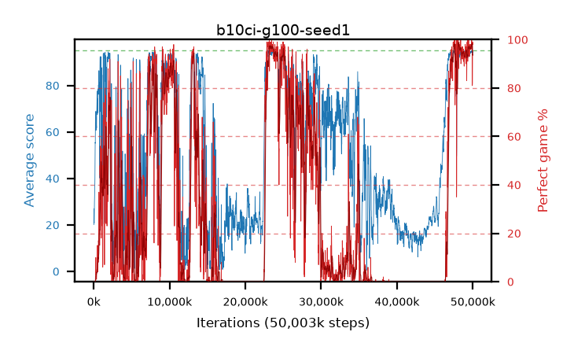

# b10ci-g100-seed1

step **50,003,968** · 3052 evals · trailing **94.25** · peak **94.32** @23,461,888 · sef **18.8** · best30 **97.3** @49,905,664

## Config

| | |
|---|---|
| algo | ppo |
| collect_envs | 128 |
| discount | 1.0 |
| eval_interval | 16384 |
| eval_queue | True |
| eval_queue_depth | 16 |
| eval_workers | 8 |
| fc_layers | (320,) |
| graph_eval_episodes | 100 |
| max_steps | 50003968 |
| min_checkpoint_score | 40.0 |
| ppo_adam_epsilon | 1e-07 |
| ppo_clip | 0.2 |
| ppo_clip_final | None |
| ppo_entropy_coef | 0.01 |
| ppo_entropy_coef_final | None |
| ppo_epochs | 4 |
| ppo_gae_lambda | 0.98 |
| ppo_gradient_clipping | 0.5 |
| ppo_horizon | 50.0 |
| ppo_learning_rate | 0.0003 |
| ppo_learning_rate_final | None |
| ppo_minibatch | 256 |
| ppo_normalize_adv | True |
| ppo_rollout | 128 |
| ppo_target_kl | 0.0 |
| ppo_transitions_per_rollout | 16384 |
| ppo_value_loss | huber |
| ppo_vf_coef | 0.5 |
| seed | 1 |
| torch_threads | 1 |

## Evals

| step | avg score | trailing avg | min score | max score | avg reward | perfect % | epsilon |
|---|---|---|---|---|---|---|---|
| 16384 | 20.13 | 23.24 | 3.0 | 41.0 | 16.66 | 0.0 |  |
| 32768 | 27.03 | 27.03 | 3.0 | 52.0 | 22.12 | 0.0 |  |
| 49152 | 21.5 | 24.27 | 7.0 | 38.0 | 16.5 | 0.0 |  |
| ... | ... | ... | ... | ... | ... | ... | ... |
| 49823744 | 94.86 | 94.09 | 86.0 | 95.0 | 191.87 | 98.0 |  |
| 49840128 | 95.0 | 94.11 | 95.0 | 95.0 | 194.0 | 100.0 |  |
| 49856512 | 95.0 | 93.89 | 95.0 | 95.0 | 194.0 | 100.0 |  |
| 49872896 | 94.58 | 94.11 | 66.0 | 95.0 | 191.59 | 98.0 |  |
| 49889280 | 94.98 | 93.96 | 93.0 | 95.0 | 192.94 | 99.0 |  |
| 49905664 | 94.63 | 94.22 | 58.0 | 95.0 | 192.635 | 99.0 |  |
| 49922048 | 94.51 | 94.24 | 68.0 | 95.0 | 173.885 | 81.0 |  |
| 49938432 | 94.57 | 94.2 | 70.0 | 95.0 | 173.855 | 81.0 |  |
| 49954816 | 93.59 | 94.17 | 10.0 | 95.0 | 173.96 | 82.0 |  |
| 49971200 | 94.38 | 94.26 | 33.0 | 95.0 | 192.34 | 99.0 |  |
| 49987584 | 94.72 | 94.26 | 67.0 | 95.0 | 192.725 | 99.0 |  |
| 50003968 | 93.86 | 94.25 | 16.0 | 95.0 | 190.87 | 98.0 |  |
