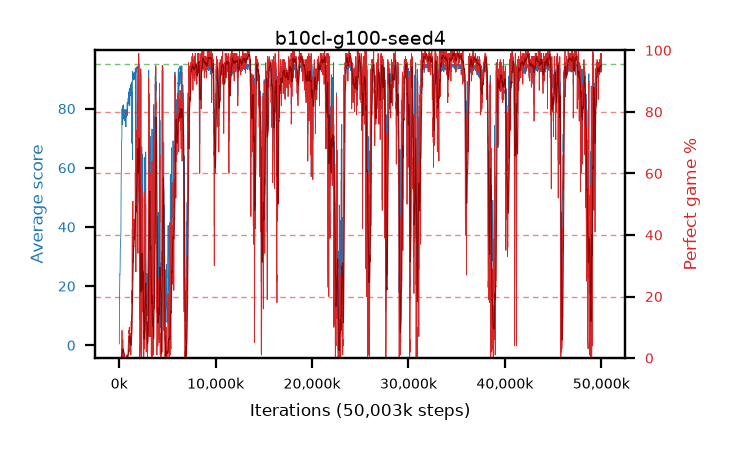

# b10cl-g100-seed4

step **50,003,968** · 3052 evals · trailing **92.46** · peak **94.46** @31,981,568 · sef **68.1** · best30 **98.3** @34,914,304

## Config

| | |
|---|---|
| algo | ppo |
| collect_envs | 128 |
| discount | 1.0 |
| eval_interval | 16384 |
| eval_queue | True |
| eval_queue_depth | 16 |
| eval_workers | 8 |
| fc_layers | (320,) |
| graph_eval_episodes | 100 |
| max_steps | 50003968 |
| min_checkpoint_score | 40.0 |
| ppo_adam_epsilon | 1e-07 |
| ppo_clip | 0.2 |
| ppo_clip_final | None |
| ppo_entropy_coef | 0.01 |
| ppo_entropy_coef_final | None |
| ppo_epochs | 4 |
| ppo_gae_lambda | 0.98 |
| ppo_gradient_clipping | 0.5 |
| ppo_horizon | 50.0 |
| ppo_learning_rate | 0.0003 |
| ppo_learning_rate_final | None |
| ppo_minibatch | 256 |
| ppo_normalize_adv | True |
| ppo_rollout | 128 |
| ppo_target_kl | 0.0 |
| ppo_transitions_per_rollout | 16384 |
| ppo_value_loss | huber |
| ppo_vf_coef | 0.5 |
| seed | 4 |
| torch_threads | 1 |

## Evals

| step | avg score | trailing avg | min score | max score | avg reward | perfect % | epsilon |
|---|---|---|---|---|---|---|---|
| 16384 | 0.48 | 0.48 | 0.0 | 3.0 | -0.875 | 0.0 |  |
| 32768 | 13.97 | 7.23 | 1.0 | 29.0 | 8.97 | 0.0 |  |
| 49152 | 17.72 | 10.72 | 6.0 | 34.0 | 12.72 | 0.0 |  |
| ... | ... | ... | ... | ... | ... | ... | ... |
| 49823744 | 93.89 | 89.89 | 53.0 | 95.0 | 189.905 | 97.0 |  |
| 49840128 | 92.75 | 90.07 | 43.0 | 95.0 | 185.78 | 94.0 |  |
| 49856512 | 92.11 | 92.94 | 19.0 | 95.0 | 185.14 | 94.0 |  |
| 49872896 | 93.28 | 93.23 | 44.0 | 95.0 | 185.315 | 93.0 |  |
| 49889280 | 92.61 | 93.08 | 43.0 | 95.0 | 185.64 | 94.0 |  |
| 49905664 | 92.75 | 92.98 | 48.0 | 95.0 | 185.78 | 94.0 |  |
| 49922048 | 94.31 | 93.16 | 26.0 | 95.0 | 192.315 | 99.0 |  |
| 49938432 | 92.76 | 93.2 | 44.0 | 95.0 | 186.785 | 95.0 |  |
| 49954816 | 93.02 | 92.99 | 44.0 | 95.0 | 187.045 | 95.0 |  |
| 49971200 | 92.79 | 91.27 | 43.0 | 95.0 | 186.815 | 95.0 |  |
| 49987584 | 94.49 | 90.86 | 44.0 | 95.0 | 192.495 | 99.0 |  |
| 50003968 | 92.46 | 92.46 | 50.0 | 95.0 | 184.495 | 93.0 |  |
