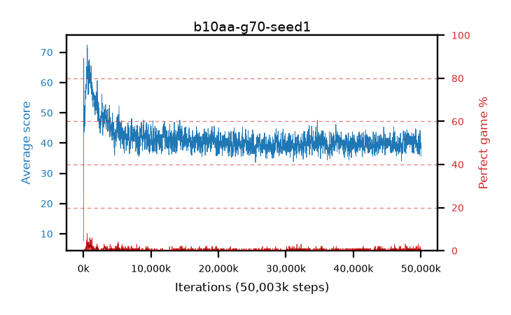

# b10aa-g70-seed1

step **50,003,968** · 3052 evals · trailing **39.88** · peak **63.35** @950,272 · sef **0.0** · best30 **2.7** @950,272

## Config

| | |
|---|---|
| algo | ppo |
| collect_envs | 128 |
| discount | 0.7 |
| eval_interval | 16384 |
| eval_queue | True |
| eval_queue_depth | 16 |
| eval_workers | 8 |
| fc_layers | (320,) |
| graph_eval_episodes | 100 |
| max_steps | 50003968 |
| min_checkpoint_score | 40.0 |
| ppo_adam_epsilon | 1e-07 |
| ppo_clip | 0.2 |
| ppo_clip_final | None |
| ppo_entropy_coef | 0.01 |
| ppo_entropy_coef_final | None |
| ppo_epochs | 4 |
| ppo_gae_lambda | 0.98 |
| ppo_gradient_clipping | 0.5 |
| ppo_horizon | 3.2 |
| ppo_learning_rate | 0.0003 |
| ppo_learning_rate_final | None |
| ppo_minibatch | 256 |
| ppo_normalize_adv | True |
| ppo_rollout | 128 |
| ppo_target_kl | 0.0 |
| ppo_transitions_per_rollout | 16384 |
| ppo_value_loss | huber |
| ppo_vf_coef | 0.5 |
| seed | 1 |
| torch_threads | 1 |

## Evals

| step | avg score | trailing avg | min score | max score | avg reward | perfect % | epsilon |
|---|---|---|---|---|---|---|---|
| 16384 | 7.66 | 7.66 | 0.0 | 23.0 | 7.16 | 0.0 |  |
| 32768 | 54.52 | 46.03 | 0.0 | 84.0 | 50.33 | 0.0 |  |
| 49152 | 68.03 | 41.91 | 30.0 | 90.0 | 66.045 | 0.0 |  |
| ... | ... | ... | ... | ... | ... | ... | ... |
| 49823744 | 39.7 | 39.86 | 8.0 | 89.0 | 34.835 | 0.0 |  |
| 49840128 | 41.78 | 39.9 | 4.0 | 91.0 | 37.05 | 0.0 |  |
| 49856512 | 44.26 | 39.9 | 14.0 | 95.0 | 40.525 | 1.0 |  |
| 49872896 | 43.43 | 39.81 | 14.0 | 93.0 | 38.745 | 0.0 |  |
| 49889280 | 42.75 | 40.06 | 12.0 | 95.0 | 39.965 | 2.0 |  |
| 49905664 | 38.34 | 39.72 | 4.0 | 91.0 | 33.385 | 0.0 |  |
| 49922048 | 43.32 | 39.92 | 12.0 | 93.0 | 38.5 | 0.0 |  |
| 49938432 | 40.4 | 40.0 | 12.0 | 95.0 | 36.485 | 1.0 |  |
| 49954816 | 39.53 | 39.93 | 10.0 | 95.0 | 35.75 | 1.0 |  |
| 49971200 | 38.17 | 40.0 | 12.0 | 87.0 | 33.26 | 0.0 |  |
| 49987584 | 40.03 | 40.04 | 16.0 | 78.0 | 35.03 | 0.0 |  |
| 50003968 | 35.53 | 39.88 | 8.0 | 91.0 | 30.62 | 0.0 |  |
