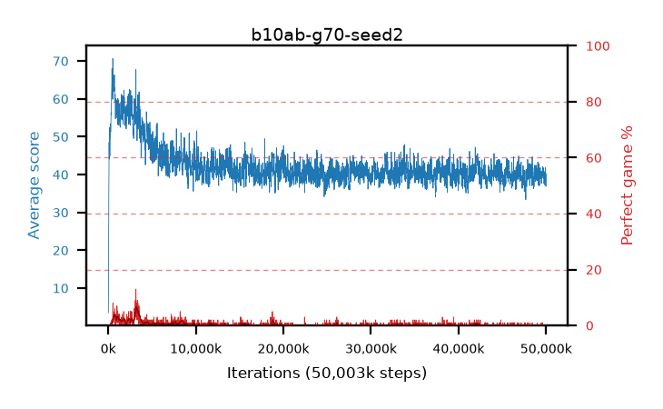

# b10ab-g70-seed2

step **50,003,968** · 3052 evals · trailing **39.9** · peak **62.78** @802,816 · sef **0.0** · best30 **5.2** @3,538,944

## Config

| | |
|---|---|
| algo | ppo |
| collect_envs | 128 |
| discount | 0.7 |
| eval_interval | 16384 |
| eval_queue | True |
| eval_queue_depth | 16 |
| eval_workers | 8 |
| fc_layers | (320,) |
| graph_eval_episodes | 100 |
| max_steps | 50003968 |
| min_checkpoint_score | 40.0 |
| ppo_adam_epsilon | 1e-07 |
| ppo_clip | 0.2 |
| ppo_clip_final | None |
| ppo_entropy_coef | 0.01 |
| ppo_entropy_coef_final | None |
| ppo_epochs | 4 |
| ppo_gae_lambda | 0.98 |
| ppo_gradient_clipping | 0.5 |
| ppo_horizon | 3.2 |
| ppo_learning_rate | 0.0003 |
| ppo_learning_rate_final | None |
| ppo_minibatch | 256 |
| ppo_normalize_adv | True |
| ppo_rollout | 128 |
| ppo_target_kl | 0.0 |
| ppo_transitions_per_rollout | 16384 |
| ppo_value_loss | huber |
| ppo_vf_coef | 0.5 |
| seed | 2 |
| torch_threads | 1 |

## Evals

| step | avg score | trailing avg | min score | max score | avg reward | perfect % | epsilon |
|---|---|---|---|---|---|---|---|
| 16384 | 3.49 | 3.49 | 0.0 | 8.0 | -1.06 | 0.0 |  |
| 32768 | 16.45 | 9.97 | 0.0 | 38.0 | 12.845 | 0.0 |  |
| 49152 | 26.85 | 20.73 | 0.0 | 62.0 | 22.345 | 0.0 |  |
| ... | ... | ... | ... | ... | ... | ... | ... |
| 49823744 | 37.32 | 39.73 | 10.0 | 84.0 | 32.365 | 0.0 |  |
| 49840128 | 40.38 | 39.91 | 12.0 | 93.0 | 35.425 | 0.0 |  |
| 49856512 | 40.33 | 39.98 | 10.0 | 93.0 | 35.51 | 0.0 |  |
| 49872896 | 38.11 | 39.88 | 10.0 | 91.0 | 33.155 | 0.0 |  |
| 49889280 | 40.57 | 39.89 | 13.0 | 93.0 | 35.75 | 0.0 |  |
| 49905664 | 40.44 | 39.93 | 12.0 | 91.0 | 35.62 | 0.0 |  |
| 49922048 | 41.87 | 39.9 | 14.0 | 85.0 | 36.96 | 0.0 |  |
| 49938432 | 39.05 | 39.82 | 9.0 | 91.0 | 34.185 | 0.0 |  |
| 49954816 | 37.2 | 39.87 | 13.0 | 89.0 | 32.245 | 0.0 |  |
| 49971200 | 36.9 | 39.83 | 10.0 | 91.0 | 32.035 | 0.0 |  |
| 49987584 | 37.36 | 39.88 | 15.0 | 81.0 | 32.405 | 0.0 |  |
| 50003968 | 40.2 | 39.9 | 11.0 | 87.0 | 35.245 | 0.0 |  |
