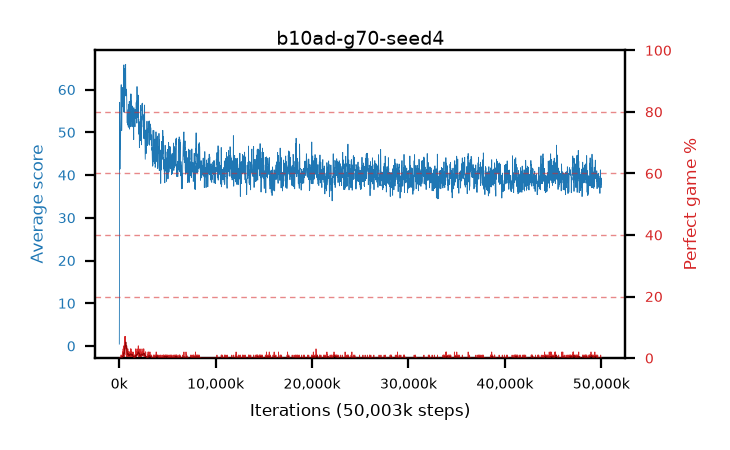

# b10ad-g70-seed4

step **50,003,968** · 3052 evals · trailing **38.64** · peak **60.16** @770,048 · sef **0.0** · best30 **2.8** @933,888

## Config

| | |
|---|---|
| algo | ppo |
| collect_envs | 128 |
| discount | 0.7 |
| eval_interval | 16384 |
| eval_queue | True |
| eval_queue_depth | 16 |
| eval_workers | 8 |
| fc_layers | (320,) |
| graph_eval_episodes | 100 |
| max_steps | 50003968 |
| min_checkpoint_score | 40.0 |
| ppo_adam_epsilon | 1e-07 |
| ppo_clip | 0.2 |
| ppo_clip_final | None |
| ppo_entropy_coef | 0.01 |
| ppo_entropy_coef_final | None |
| ppo_epochs | 4 |
| ppo_gae_lambda | 0.98 |
| ppo_gradient_clipping | 0.5 |
| ppo_horizon | 3.2 |
| ppo_learning_rate | 0.0003 |
| ppo_learning_rate_final | None |
| ppo_minibatch | 256 |
| ppo_normalize_adv | True |
| ppo_rollout | 128 |
| ppo_target_kl | 0.0 |
| ppo_transitions_per_rollout | 16384 |
| ppo_value_loss | huber |
| ppo_vf_coef | 0.5 |
| seed | 4 |
| torch_threads | 1 |

## Evals

| step | avg score | trailing avg | min score | max score | avg reward | perfect % | epsilon |
|---|---|---|---|---|---|---|---|
| 16384 | 0.44 | 0.44 | 0.0 | 7.0 | -0.15 | 0.0 |  |
| 32768 | 17.74 | 33.55 | 0.0 | 65.0 | 15.62 | 0.0 |  |
| 49152 | 57.03 | 36.9 | 1.0 | 90.0 | 53.29 | 0.0 |  |
| ... | ... | ... | ... | ... | ... | ... | ... |
| 49823744 | 37.26 | 39.14 | 9.0 | 91.0 | 32.35 | 0.0 |  |
| 49840128 | 37.92 | 39.05 | 12.0 | 87.0 | 33.055 | 0.0 |  |
| 49856512 | 35.72 | 39.39 | 16.0 | 74.0 | 30.72 | 0.0 |  |
| 49872896 | 39.74 | 38.71 | 10.0 | 91.0 | 34.83 | 0.0 |  |
| 49889280 | 39.11 | 38.69 | 7.0 | 88.0 | 34.245 | 0.0 |  |
| 49905664 | 41.21 | 38.74 | 14.0 | 93.0 | 36.3 | 0.0 |  |
| 49922048 | 37.61 | 38.7 | 13.0 | 81.0 | 32.655 | 0.0 |  |
| 49938432 | 39.13 | 38.7 | 8.0 | 95.0 | 35.215 | 1.0 |  |
| 49954816 | 38.65 | 38.67 | 12.0 | 86.0 | 33.65 | 0.0 |  |
| 49971200 | 37.05 | 38.54 | 8.0 | 93.0 | 32.14 | 0.0 |  |
| 49987584 | 39.3 | 38.67 | 15.0 | 89.0 | 34.345 | 0.0 |  |
| 50003968 | 37.81 | 38.64 | 12.0 | 91.0 | 32.945 | 0.0 |  |
