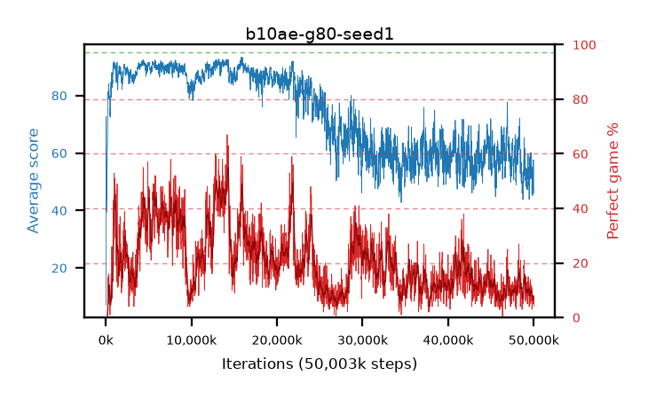

# b10ae-g80-seed1

step **50,003,968** · 3052 evals · trailing **53.14** · peak **91.34** @14,319,616 · sef **0.0** · best30 **49.7** @14,336,000

## Config

| | |
|---|---|
| algo | ppo |
| collect_envs | 128 |
| discount | 0.8 |
| eval_interval | 16384 |
| eval_queue | True |
| eval_queue_depth | 16 |
| eval_workers | 8 |
| fc_layers | (320,) |
| graph_eval_episodes | 100 |
| max_steps | 50003968 |
| min_checkpoint_score | 40.0 |
| ppo_adam_epsilon | 1e-07 |
| ppo_clip | 0.2 |
| ppo_clip_final | None |
| ppo_entropy_coef | 0.01 |
| ppo_entropy_coef_final | None |
| ppo_epochs | 4 |
| ppo_gae_lambda | 0.98 |
| ppo_gradient_clipping | 0.5 |
| ppo_horizon | 4.6 |
| ppo_learning_rate | 0.0003 |
| ppo_learning_rate_final | None |
| ppo_minibatch | 256 |
| ppo_normalize_adv | True |
| ppo_rollout | 128 |
| ppo_target_kl | 0.0 |
| ppo_transitions_per_rollout | 16384 |
| ppo_value_loss | huber |
| ppo_vf_coef | 0.5 |
| seed | 1 |
| torch_threads | 1 |

## Evals

| step | avg score | trailing avg | min score | max score | avg reward | perfect % | epsilon |
|---|---|---|---|---|---|---|---|
| 16384 | 7.09 | 7.09 | 0.0 | 18.0 | 6.59 | 0.0 |  |
| 32768 | 46.45 | 40.16 | 0.0 | 86.0 | 43.34 | 0.0 |  |
| 49152 | 72.72 | 44.63 | 30.0 | 93.0 | 70.78 | 0.0 |  |
| ... | ... | ... | ... | ... | ... | ... | ... |
| 49823744 | 50.76 | 52.8 | 5.0 | 95.0 | 53.94 | 7.0 |  |
| 49840128 | 54.77 | 52.74 | 17.0 | 95.0 | 59.215 | 8.0 |  |
| 49856512 | 45.19 | 52.62 | 14.0 | 95.0 | 48.055 | 7.0 |  |
| 49872896 | 49.88 | 52.88 | 10.0 | 95.0 | 54.235 | 8.0 |  |
| 49889280 | 52.8 | 52.84 | 10.0 | 95.0 | 54.035 | 5.0 |  |
| 49905664 | 54.51 | 52.92 | 7.0 | 95.0 | 58.91 | 8.0 |  |
| 49922048 | 46.84 | 53.53 | 7.0 | 95.0 | 48.8 | 6.0 |  |
| 49938432 | 54.05 | 52.97 | 16.0 | 95.0 | 57.41 | 7.0 |  |
| 49954816 | 57.68 | 53.18 | 12.0 | 95.0 | 61.31 | 7.0 |  |
| 49971200 | 53.07 | 53.23 | 13.0 | 95.0 | 54.44 | 5.0 |  |
| 49987584 | 48.32 | 52.62 | 13.0 | 95.0 | 52.45 | 8.0 |  |
| 50003968 | 45.95 | 53.14 | 4.0 | 95.0 | 45.65 | 4.0 |  |
