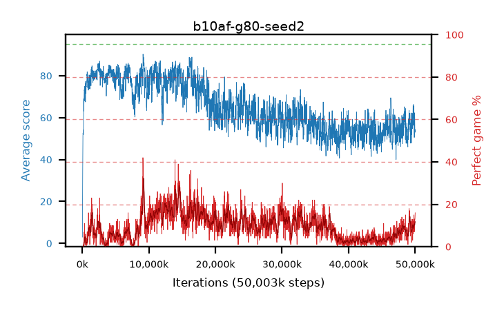

# b10af-g80-seed2

step **50,003,968** · 3052 evals · trailing **59.19** · peak **83.56** @16,154,624 · sef **0.0** · best30 **24.4** @14,761,984

## Config

| | |
|---|---|
| algo | ppo |
| collect_envs | 128 |
| discount | 0.8 |
| eval_interval | 16384 |
| eval_queue | True |
| eval_queue_depth | 16 |
| eval_workers | 8 |
| fc_layers | (320,) |
| graph_eval_episodes | 100 |
| max_steps | 50003968 |
| min_checkpoint_score | 40.0 |
| ppo_adam_epsilon | 1e-07 |
| ppo_clip | 0.2 |
| ppo_clip_final | None |
| ppo_entropy_coef | 0.01 |
| ppo_entropy_coef_final | None |
| ppo_epochs | 4 |
| ppo_gae_lambda | 0.98 |
| ppo_gradient_clipping | 0.5 |
| ppo_horizon | 4.6 |
| ppo_learning_rate | 0.0003 |
| ppo_learning_rate_final | None |
| ppo_minibatch | 256 |
| ppo_normalize_adv | True |
| ppo_rollout | 128 |
| ppo_target_kl | 0.0 |
| ppo_transitions_per_rollout | 16384 |
| ppo_value_loss | huber |
| ppo_vf_coef | 0.5 |
| seed | 2 |
| torch_threads | 1 |

## Evals

| step | avg score | trailing avg | min score | max score | avg reward | perfect % | epsilon |
|---|---|---|---|---|---|---|---|
| 16384 | 3.01 | 3.01 | 0.0 | 8.0 | -1.09 | 0.0 |  |
| 32768 | 15.88 | 9.45 | 0.0 | 29.0 | 11.645 | 0.0 |  |
| 49152 | 32.88 | 21.81 | 0.0 | 68.0 | 28.105 | 0.0 |  |
| ... | ... | ... | ... | ... | ... | ... | ... |
| 49823744 | 62.48 | 57.99 | 11.0 | 95.0 | 74.43 | 15.0 |  |
| 49840128 | 56.34 | 58.67 | 12.0 | 95.0 | 64.81 | 12.0 |  |
| 49856512 | 58.46 | 58.88 | 9.0 | 95.0 | 65.03 | 10.0 |  |
| 49872896 | 50.55 | 58.55 | 17.0 | 95.0 | 53.595 | 7.0 |  |
| 49889280 | 57.47 | 58.68 | 18.0 | 95.0 | 67.16 | 13.0 |  |
| 49905664 | 52.12 | 58.74 | 8.0 | 95.0 | 56.295 | 8.0 |  |
| 49922048 | 62.27 | 59.15 | 5.0 | 95.0 | 69.11 | 10.0 |  |
| 49938432 | 60.02 | 59.18 | 12.0 | 95.0 | 69.755 | 13.0 |  |
| 49954816 | 54.38 | 59.1 | 10.0 | 95.0 | 63.755 | 13.0 |  |
| 49971200 | 52.98 | 58.88 | 8.0 | 95.0 | 62.31 | 13.0 |  |
| 49987584 | 52.97 | 58.92 | 10.0 | 95.0 | 64.2 | 15.0 |  |
| 50003968 | 54.32 | 59.19 | 13.0 | 95.0 | 66.725 | 16.0 |  |
