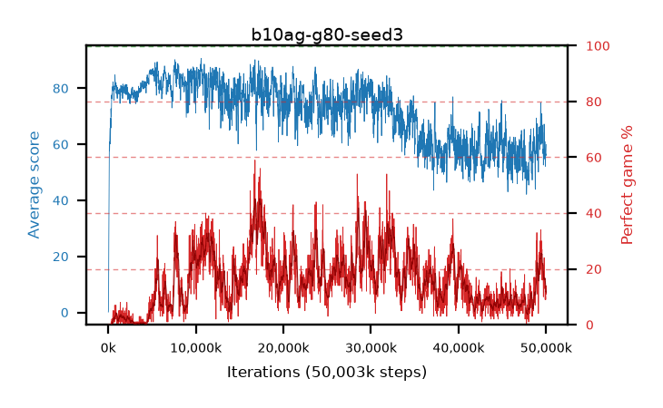

# b10ag-g80-seed3

step **50,003,968** · 3052 evals · trailing **58.86** · peak **86.18** @7,913,472 · sef **0.0** · best30 **41.8** @17,498,112

## Config

| | |
|---|---|
| algo | ppo |
| collect_envs | 128 |
| discount | 0.8 |
| eval_interval | 16384 |
| eval_queue | True |
| eval_queue_depth | 16 |
| eval_workers | 8 |
| fc_layers | (320,) |
| graph_eval_episodes | 100 |
| max_steps | 50003968 |
| min_checkpoint_score | 40.0 |
| ppo_adam_epsilon | 1e-07 |
| ppo_clip | 0.2 |
| ppo_clip_final | None |
| ppo_entropy_coef | 0.01 |
| ppo_entropy_coef_final | None |
| ppo_epochs | 4 |
| ppo_gae_lambda | 0.98 |
| ppo_gradient_clipping | 0.5 |
| ppo_horizon | 4.6 |
| ppo_learning_rate | 0.0003 |
| ppo_learning_rate_final | None |
| ppo_minibatch | 256 |
| ppo_normalize_adv | True |
| ppo_rollout | 128 |
| ppo_target_kl | 0.0 |
| ppo_transitions_per_rollout | 16384 |
| ppo_value_loss | huber |
| ppo_vf_coef | 0.5 |
| seed | 3 |
| torch_threads | 1 |

## Evals

| step | avg score | trailing avg | min score | max score | avg reward | perfect % | epsilon |
|---|---|---|---|---|---|---|---|
| 16384 | 0.13 | 0.13 | 0.0 | 1.0 | -0.37 | 0.0 |  |
| 32768 | 1.3 | 0.72 | 0.0 | 6.0 | 0.8 | 0.0 |  |
| 49152 | 17.33 | 6.25 | 0.0 | 47.0 | 15.435 | 0.0 |  |
| ... | ... | ... | ... | ... | ... | ... | ... |
| 49823744 | 60.51 | 63.71 | 14.0 | 95.0 | 70.11 | 13.0 |  |
| 49840128 | 54.89 | 61.47 | 11.0 | 95.0 | 67.205 | 16.0 |  |
| 49856512 | 60.98 | 62.61 | 9.0 | 95.0 | 72.75 | 15.0 |  |
| 49872896 | 54.93 | 62.13 | 14.0 | 95.0 | 64.395 | 13.0 |  |
| 49889280 | 57.02 | 59.85 | 14.0 | 95.0 | 62.55 | 9.0 |  |
| 49905664 | 54.17 | 60.47 | 12.0 | 95.0 | 62.505 | 12.0 |  |
| 49922048 | 52.15 | 60.04 | 15.0 | 95.0 | 58.18 | 10.0 |  |
| 49938432 | 55.75 | 60.9 | 14.0 | 95.0 | 62.005 | 10.0 |  |
| 49954816 | 56.57 | 60.67 | 18.0 | 95.0 | 62.1 | 9.0 |  |
| 49971200 | 55.98 | 59.23 | 12.0 | 95.0 | 64.495 | 12.0 |  |
| 49987584 | 58.06 | 59.72 | 14.0 | 95.0 | 68.565 | 14.0 |  |
| 50003968 | 59.9 | 58.86 | 17.0 | 95.0 | 67.69 | 11.0 |  |
