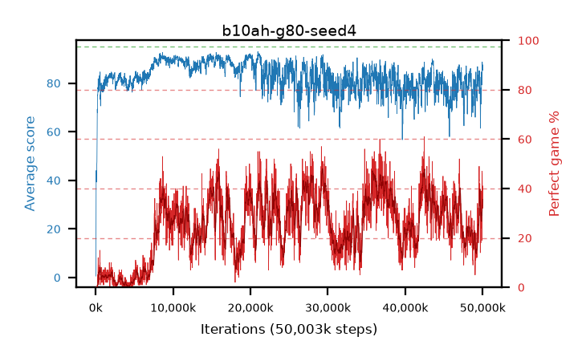

# b10ah-g80-seed4

step **50,003,968** · 3052 evals · trailing **79.49** · peak **90.72** @8,962,048 · sef **0.0** · best30 **45.2** @36,175,872

## Config

| | |
|---|---|
| algo | ppo |
| collect_envs | 128 |
| discount | 0.8 |
| eval_interval | 16384 |
| eval_queue | True |
| eval_queue_depth | 16 |
| eval_workers | 8 |
| fc_layers | (320,) |
| graph_eval_episodes | 100 |
| max_steps | 50003968 |
| min_checkpoint_score | 40.0 |
| ppo_adam_epsilon | 1e-07 |
| ppo_clip | 0.2 |
| ppo_clip_final | None |
| ppo_entropy_coef | 0.01 |
| ppo_entropy_coef_final | None |
| ppo_epochs | 4 |
| ppo_gae_lambda | 0.98 |
| ppo_gradient_clipping | 0.5 |
| ppo_horizon | 4.6 |
| ppo_learning_rate | 0.0003 |
| ppo_learning_rate_final | None |
| ppo_minibatch | 256 |
| ppo_normalize_adv | True |
| ppo_rollout | 128 |
| ppo_target_kl | 0.0 |
| ppo_transitions_per_rollout | 16384 |
| ppo_value_loss | huber |
| ppo_vf_coef | 0.5 |
| seed | 4 |
| torch_threads | 1 |

## Evals

| step | avg score | trailing avg | min score | max score | avg reward | perfect % | epsilon |
|---|---|---|---|---|---|---|---|
| 16384 | 0.6 | 0.6 | 0.0 | 4.0 | 0.01 | 0.0 |  |
| 32768 | 5.13 | 2.86 | 0.0 | 17.0 | 4.45 | 0.0 |  |
| 49152 | 25.5 | 28.1 | 0.0 | 75.0 | 23.38 | 0.0 |  |
| ... | ... | ... | ... | ... | ... | ... | ... |
| 49823744 | 73.33 | 78.36 | 11.0 | 95.0 | 97.215 | 26.0 |  |
| 49840128 | 79.86 | 78.13 | 26.0 | 95.0 | 109.125 | 31.0 |  |
| 49856512 | 84.65 | 78.23 | 18.0 | 95.0 | 117.53 | 34.0 |  |
| 49872896 | 79.28 | 78.88 | 24.0 | 95.0 | 105.875 | 28.0 |  |
| 49889280 | 84.03 | 78.65 | 19.0 | 95.0 | 119.76 | 37.0 |  |
| 49905664 | 83.73 | 78.63 | 23.0 | 95.0 | 101.505 | 19.0 |  |
| 49922048 | 86.78 | 78.5 | 19.0 | 95.0 | 132.64 | 47.0 |  |
| 49938432 | 88.73 | 79.14 | 19.0 | 95.0 | 133.685 | 46.0 |  |
| 49954816 | 87.22 | 78.83 | 17.0 | 95.0 | 125.255 | 39.0 |  |
| 49971200 | 86.51 | 79.32 | 21.0 | 95.0 | 118.53 | 33.0 |  |
| 49987584 | 85.25 | 78.94 | 18.0 | 95.0 | 116.05 | 32.0 |  |
| 50003968 | 87.47 | 79.49 | 18.0 | 95.0 | 127.315 | 41.0 |  |
