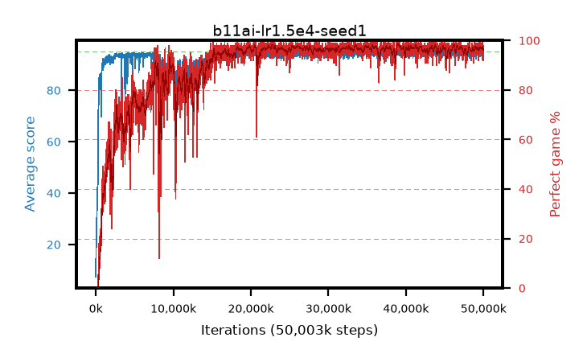

# b11ai-lr1.5e4-seed1

step **50,003,968** · 3052 evals · trailing **94.24** · peak **94.47** @33,636,352 · sef **83.4** · best30 **98.0** @39,206,912

## Config

| | |
|---|---|
| algo | ppo |
| collect_envs | 128 |
| discount | 0.99 |
| eval_interval | 16384 |
| eval_queue | True |
| eval_queue_depth | 16 |
| eval_workers | 8 |
| fc_layers | (320,) |
| graph_eval_episodes | 100 |
| max_steps | 50003968 |
| min_checkpoint_score | 40.0 |
| ppo_adam_epsilon | 1e-07 |
| ppo_clip | 0.2 |
| ppo_clip_final | None |
| ppo_entropy_coef | 0.01 |
| ppo_entropy_coef_final | None |
| ppo_epochs | 4 |
| ppo_gae_lambda | 0.99 |
| ppo_gradient_clipping | 0.5 |
| ppo_horizon | 50.3 |
| ppo_learning_rate | 0.00015 |
| ppo_learning_rate_final | None |
| ppo_minibatch | 256 |
| ppo_normalize_adv | True |
| ppo_rollout | 128 |
| ppo_target_kl | 0.0 |
| ppo_transitions_per_rollout | 16384 |
| ppo_value_loss | huber |
| ppo_vf_coef | 0.5 |
| seed | 1 |
| torch_threads | 1 |

## Evals

| step | avg score | trailing avg | min score | max score | avg reward | perfect % | epsilon |
|---|---|---|---|---|---|---|---|
| 16384 | 7.44 | 15.22 | 1.0 | 31.0 | 6.76 | 0.0 |  |
| 32768 | 19.21 | 19.21 | 6.0 | 35.0 | 14.21 | 0.0 |  |
| 49152 | 19.0 | 19.11 | 6.0 | 42.0 | 14.0 | 0.0 |  |
| ... | ... | ... | ... | ... | ... | ... | ... |
| 49823744 | 94.35 | 94.28 | 57.0 | 95.0 | 189.37 | 96.0 |  |
| 49840128 | 94.14 | 94.32 | 53.0 | 95.0 | 190.155 | 97.0 |  |
| 49856512 | 94.21 | 94.24 | 58.0 | 95.0 | 190.225 | 97.0 |  |
| 49872896 | 94.95 | 94.29 | 90.0 | 95.0 | 192.955 | 99.0 |  |
| 49889280 | 95.0 | 94.36 | 95.0 | 95.0 | 194.0 | 100.0 |  |
| 49905664 | 93.56 | 94.37 | 63.0 | 95.0 | 184.6 | 92.0 |  |
| 49922048 | 93.69 | 94.33 | 38.0 | 95.0 | 188.665 | 96.0 |  |
| 49938432 | 94.58 | 94.25 | 64.0 | 95.0 | 189.6 | 96.0 |  |
| 49954816 | 93.33 | 94.24 | 22.0 | 95.0 | 184.37 | 92.0 |  |
| 49971200 | 93.32 | 94.29 | 10.0 | 95.0 | 190.33 | 98.0 |  |
| 49987584 | 94.69 | 94.24 | 76.0 | 95.0 | 190.705 | 97.0 |  |
| 50003968 | 94.34 | 94.24 | 60.0 | 95.0 | 191.35 | 98.0 |  |
