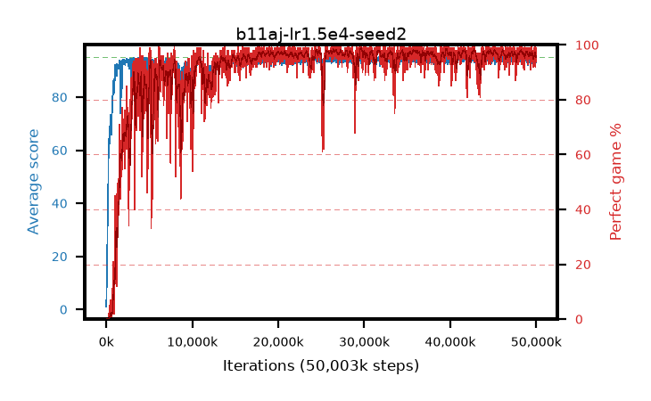

# b11aj-lr1.5e4-seed2

step **50,003,968** · 3052 evals · trailing **94.05** · peak **94.52** @26,738,688 · sef **90.2** · best30 **98.1** @26,705,920

## Config

| | |
|---|---|
| algo | ppo |
| collect_envs | 128 |
| discount | 0.99 |
| eval_interval | 16384 |
| eval_queue | True |
| eval_queue_depth | 16 |
| eval_workers | 8 |
| fc_layers | (320,) |
| graph_eval_episodes | 100 |
| max_steps | 50003968 |
| min_checkpoint_score | 40.0 |
| ppo_adam_epsilon | 1e-07 |
| ppo_clip | 0.2 |
| ppo_clip_final | None |
| ppo_entropy_coef | 0.01 |
| ppo_entropy_coef_final | None |
| ppo_epochs | 4 |
| ppo_gae_lambda | 0.99 |
| ppo_gradient_clipping | 0.5 |
| ppo_horizon | 50.3 |
| ppo_learning_rate | 0.00015 |
| ppo_learning_rate_final | None |
| ppo_minibatch | 256 |
| ppo_normalize_adv | True |
| ppo_rollout | 128 |
| ppo_target_kl | 0.0 |
| ppo_transitions_per_rollout | 16384 |
| ppo_value_loss | huber |
| ppo_vf_coef | 0.5 |
| seed | 2 |
| torch_threads | 1 |

## Evals

| step | avg score | trailing avg | min score | max score | avg reward | perfect % | epsilon |
|---|---|---|---|---|---|---|---|
| 16384 | 1.05 | 1.05 | 0.0 | 5.0 | -0.35 | 0.0 |  |
| 32768 | 6.2 | 3.62 | 2.0 | 18.0 | 1.2 | 0.0 |  |
| 49152 | 9.84 | 5.7 | 2.0 | 24.0 | 4.84 | 0.0 |  |
| ... | ... | ... | ... | ... | ... | ... | ... |
| 49823744 | 94.59 | 93.97 | 54.0 | 95.0 | 192.595 | 99.0 |  |
| 49840128 | 93.59 | 93.99 | 57.0 | 95.0 | 186.62 | 94.0 |  |
| 49856512 | 95.0 | 94.07 | 95.0 | 95.0 | 194.0 | 100.0 |  |
| 49872896 | 94.56 | 94.03 | 64.0 | 95.0 | 191.57 | 98.0 |  |
| 49889280 | 94.24 | 94.06 | 73.0 | 95.0 | 187.27 | 94.0 |  |
| 49905664 | 93.64 | 94.02 | 57.0 | 95.0 | 184.68 | 92.0 |  |
| 49922048 | 93.45 | 94.0 | 56.0 | 95.0 | 186.48 | 94.0 |  |
| 49938432 | 94.48 | 94.04 | 67.0 | 95.0 | 188.505 | 95.0 |  |
| 49954816 | 92.94 | 94.01 | 28.0 | 95.0 | 185.97 | 94.0 |  |
| 49971200 | 94.29 | 94.03 | 56.0 | 95.0 | 191.3 | 98.0 |  |
| 49987584 | 94.9 | 94.06 | 85.0 | 95.0 | 192.905 | 99.0 |  |
| 50003968 | 94.23 | 94.05 | 63.0 | 95.0 | 189.25 | 96.0 |  |
