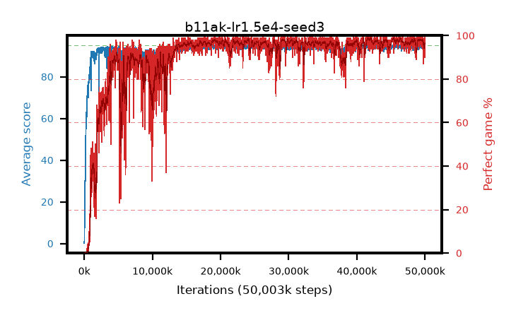

# b11ak-lr1.5e4-seed3

step **50,003,968** · 3052 evals · trailing **94.24** · peak **94.65** @45,400,064 · sef **88.3** · best30 **98.4** @41,959,424

## Config

| | |
|---|---|
| algo | ppo |
| collect_envs | 128 |
| discount | 0.99 |
| eval_interval | 16384 |
| eval_queue | True |
| eval_queue_depth | 16 |
| eval_workers | 8 |
| fc_layers | (320,) |
| graph_eval_episodes | 100 |
| max_steps | 50003968 |
| min_checkpoint_score | 40.0 |
| ppo_adam_epsilon | 1e-07 |
| ppo_clip | 0.2 |
| ppo_clip_final | None |
| ppo_entropy_coef | 0.01 |
| ppo_entropy_coef_final | None |
| ppo_epochs | 4 |
| ppo_gae_lambda | 0.99 |
| ppo_gradient_clipping | 0.5 |
| ppo_horizon | 50.3 |
| ppo_learning_rate | 0.00015 |
| ppo_learning_rate_final | None |
| ppo_minibatch | 256 |
| ppo_normalize_adv | True |
| ppo_rollout | 128 |
| ppo_target_kl | 0.0 |
| ppo_transitions_per_rollout | 16384 |
| ppo_value_loss | huber |
| ppo_vf_coef | 0.5 |
| seed | 3 |
| torch_threads | 1 |

## Evals

| step | avg score | trailing avg | min score | max score | avg reward | perfect % | epsilon |
|---|---|---|---|---|---|---|---|
| 16384 | 0.17 | 0.17 | 0.0 | 1.0 | -0.33 | 0.0 |  |
| 32768 | 1.52 | 0.84 | 0.0 | 6.0 | 0.75 | 0.0 |  |
| 49152 | 10.95 | 4.21 | 0.0 | 23.0 | 6.85 | 0.0 |  |
| ... | ... | ... | ... | ... | ... | ... | ... |
| 49823744 | 94.18 | 94.5 | 67.0 | 95.0 | 189.2 | 96.0 |  |
| 49840128 | 92.78 | 94.41 | 6.0 | 95.0 | 184.77 | 93.0 |  |
| 49856512 | 93.25 | 94.46 | 12.0 | 95.0 | 189.265 | 97.0 |  |
| 49872896 | 94.08 | 94.38 | 40.0 | 95.0 | 191.045 | 98.0 |  |
| 49889280 | 94.36 | 94.21 | 57.0 | 95.0 | 190.375 | 97.0 |  |
| 49905664 | 94.64 | 94.21 | 59.0 | 95.0 | 192.645 | 99.0 |  |
| 49922048 | 95.0 | 94.19 | 95.0 | 95.0 | 194.0 | 100.0 |  |
| 49938432 | 94.49 | 94.19 | 61.0 | 95.0 | 190.505 | 97.0 |  |
| 49954816 | 93.02 | 94.18 | 30.0 | 95.0 | 182.07 | 90.0 |  |
| 49971200 | 93.81 | 94.22 | 20.0 | 95.0 | 189.825 | 97.0 |  |
| 49987584 | 94.07 | 94.17 | 62.0 | 95.0 | 187.1 | 94.0 |  |
| 50003968 | 94.48 | 94.24 | 72.0 | 95.0 | 189.5 | 96.0 |  |
