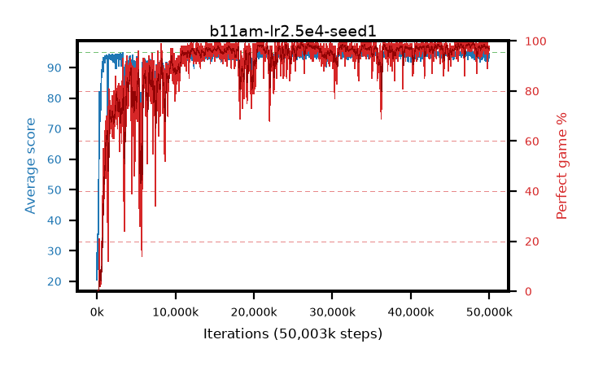

# b11am-lr2.5e4-seed1

step **50,003,968** · 3052 evals · trailing **94.13** · peak **94.66** @27,197,440 · sef **88.4** · best30 **98.7** @48,103,424

## Config

| | |
|---|---|
| algo | ppo |
| collect_envs | 128 |
| discount | 0.99 |
| eval_interval | 16384 |
| eval_queue | True |
| eval_queue_depth | 16 |
| eval_workers | 8 |
| fc_layers | (320,) |
| graph_eval_episodes | 100 |
| max_steps | 50003968 |
| min_checkpoint_score | 40.0 |
| ppo_adam_epsilon | 1e-07 |
| ppo_clip | 0.2 |
| ppo_clip_final | None |
| ppo_entropy_coef | 0.01 |
| ppo_entropy_coef_final | None |
| ppo_epochs | 4 |
| ppo_gae_lambda | 0.99 |
| ppo_gradient_clipping | 0.5 |
| ppo_horizon | 50.3 |
| ppo_learning_rate | 0.00025 |
| ppo_learning_rate_final | None |
| ppo_minibatch | 256 |
| ppo_normalize_adv | True |
| ppo_rollout | 128 |
| ppo_target_kl | 0.0 |
| ppo_transitions_per_rollout | 16384 |
| ppo_value_loss | huber |
| ppo_vf_coef | 0.5 |
| seed | 1 |
| torch_threads | 1 |

## Evals

| step | avg score | trailing avg | min score | max score | avg reward | perfect % | epsilon |
|---|---|---|---|---|---|---|---|
| 16384 | 20.47 | 20.47 | 3.0 | 45.0 | 16.28 | 0.0 |  |
| 32768 | 35.53 | 26.58 | 11.0 | 73.0 | 30.53 | 0.0 |  |
| 49152 | 26.32 | 23.6 | 2.0 | 53.0 | 21.365 | 0.0 |  |
| ... | ... | ... | ... | ... | ... | ... | ... |
| 49823744 | 94.46 | 94.17 | 56.0 | 95.0 | 191.47 | 98.0 |  |
| 49840128 | 94.68 | 94.17 | 79.0 | 95.0 | 189.655 | 96.0 |  |
| 49856512 | 94.62 | 94.18 | 68.0 | 95.0 | 191.63 | 98.0 |  |
| 49872896 | 93.98 | 94.06 | 26.0 | 95.0 | 190.945 | 98.0 |  |
| 49889280 | 92.23 | 94.08 | 16.0 | 95.0 | 186.165 | 95.0 |  |
| 49905664 | 93.83 | 94.12 | 26.0 | 95.0 | 189.845 | 97.0 |  |
| 49922048 | 94.36 | 94.07 | 57.0 | 95.0 | 190.33 | 97.0 |  |
| 49938432 | 94.31 | 94.15 | 58.0 | 95.0 | 189.33 | 96.0 |  |
| 49954816 | 93.71 | 94.1 | 39.0 | 95.0 | 189.68 | 97.0 |  |
| 49971200 | 93.17 | 94.09 | 18.0 | 95.0 | 188.145 | 96.0 |  |
| 49987584 | 94.71 | 94.14 | 72.0 | 95.0 | 191.72 | 98.0 |  |
| 50003968 | 94.57 | 94.13 | 73.0 | 95.0 | 190.585 | 97.0 |  |
