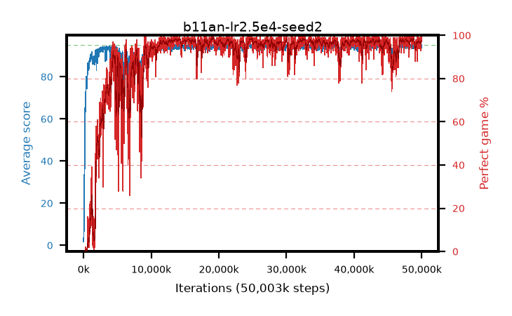

# b11an-lr2.5e4-seed2

step **50,003,968** · 3052 evals · trailing **94.3** · peak **94.64** @19,267,584 · sef **87.9** · best30 **98.6** @19,234,816

## Config

| | |
|---|---|
| algo | ppo |
| collect_envs | 128 |
| discount | 0.99 |
| eval_interval | 16384 |
| eval_queue | True |
| eval_queue_depth | 16 |
| eval_workers | 8 |
| fc_layers | (320,) |
| graph_eval_episodes | 100 |
| max_steps | 50003968 |
| min_checkpoint_score | 40.0 |
| ppo_adam_epsilon | 1e-07 |
| ppo_clip | 0.2 |
| ppo_clip_final | None |
| ppo_entropy_coef | 0.01 |
| ppo_entropy_coef_final | None |
| ppo_epochs | 4 |
| ppo_gae_lambda | 0.99 |
| ppo_gradient_clipping | 0.5 |
| ppo_horizon | 50.3 |
| ppo_learning_rate | 0.00025 |
| ppo_learning_rate_final | None |
| ppo_minibatch | 256 |
| ppo_normalize_adv | True |
| ppo_rollout | 128 |
| ppo_target_kl | 0.0 |
| ppo_transitions_per_rollout | 16384 |
| ppo_value_loss | huber |
| ppo_vf_coef | 0.5 |
| seed | 2 |
| torch_threads | 1 |

## Evals

| step | avg score | trailing avg | min score | max score | avg reward | perfect % | epsilon |
|---|---|---|---|---|---|---|---|
| 16384 | 1.74 | 1.74 | 0.0 | 5.0 | -1.37 | 0.0 |  |
| 32768 | 4.8 | 3.27 | 2.0 | 10.0 | -0.155 | 0.0 |  |
| 49152 | 7.71 | 4.75 | 2.0 | 24.0 | 2.71 | 0.0 |  |
| ... | ... | ... | ... | ... | ... | ... | ... |
| 49823744 | 95.0 | 94.4 | 95.0 | 95.0 | 194.0 | 100.0 |  |
| 49840128 | 94.34 | 94.34 | 72.0 | 95.0 | 189.36 | 96.0 |  |
| 49856512 | 93.55 | 94.36 | 30.0 | 95.0 | 185.54 | 93.0 |  |
| 49872896 | 94.44 | 94.24 | 60.0 | 95.0 | 189.46 | 96.0 |  |
| 49889280 | 94.86 | 94.3 | 81.0 | 95.0 | 192.865 | 99.0 |  |
| 49905664 | 93.16 | 94.25 | 10.0 | 95.0 | 187.185 | 95.0 |  |
| 49922048 | 94.97 | 94.25 | 92.0 | 95.0 | 192.975 | 99.0 |  |
| 49938432 | 94.66 | 94.3 | 79.0 | 95.0 | 190.675 | 97.0 |  |
| 49954816 | 95.0 | 94.27 | 95.0 | 95.0 | 194.0 | 100.0 |  |
| 49971200 | 93.8 | 94.31 | 12.0 | 95.0 | 190.81 | 98.0 |  |
| 49987584 | 95.0 | 94.3 | 95.0 | 95.0 | 194.0 | 100.0 |  |
| 50003968 | 94.29 | 94.3 | 24.0 | 95.0 | 192.295 | 99.0 |  |
