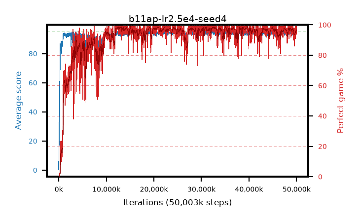

# b11ap-lr2.5e4-seed4

step **50,003,968** · 3052 evals · trailing **94.12** · peak **94.65** @32,751,616 · sef **90.5** · best30 **98.2** @12,517,376

## Config

| | |
|---|---|
| algo | ppo |
| collect_envs | 128 |
| discount | 0.99 |
| eval_interval | 16384 |
| eval_queue | True |
| eval_queue_depth | 16 |
| eval_workers | 8 |
| fc_layers | (320,) |
| graph_eval_episodes | 100 |
| max_steps | 50003968 |
| min_checkpoint_score | 40.0 |
| ppo_adam_epsilon | 1e-07 |
| ppo_clip | 0.2 |
| ppo_clip_final | None |
| ppo_entropy_coef | 0.01 |
| ppo_entropy_coef_final | None |
| ppo_epochs | 4 |
| ppo_gae_lambda | 0.99 |
| ppo_gradient_clipping | 0.5 |
| ppo_horizon | 50.3 |
| ppo_learning_rate | 0.00025 |
| ppo_learning_rate_final | None |
| ppo_minibatch | 256 |
| ppo_normalize_adv | True |
| ppo_rollout | 128 |
| ppo_target_kl | 0.0 |
| ppo_transitions_per_rollout | 16384 |
| ppo_value_loss | huber |
| ppo_vf_coef | 0.5 |
| seed | 4 |
| torch_threads | 1 |

## Evals

| step | avg score | trailing avg | min score | max score | avg reward | perfect % | epsilon |
|---|---|---|---|---|---|---|---|
| 16384 | 0.2 | 0.2 | 0.0 | 2.0 | -0.615 | 0.0 |  |
| 32768 | 14.04 | 11.49 | 2.0 | 24.0 | 9.13 | 0.0 |  |
| 49152 | 20.23 | 10.21 | 6.0 | 35.0 | 15.23 | 0.0 |  |
| ... | ... | ... | ... | ... | ... | ... | ... |
| 49823744 | 94.02 | 93.93 | 60.0 | 95.0 | 188.045 | 95.0 |  |
| 49840128 | 94.63 | 94.07 | 72.0 | 95.0 | 190.645 | 97.0 |  |
| 49856512 | 94.6 | 94.02 | 67.0 | 95.0 | 190.615 | 97.0 |  |
| 49872896 | 93.57 | 94.06 | 10.0 | 95.0 | 186.6 | 94.0 |  |
| 49889280 | 94.73 | 93.97 | 84.0 | 95.0 | 190.745 | 97.0 |  |
| 49905664 | 93.92 | 94.06 | 8.0 | 95.0 | 189.935 | 97.0 |  |
| 49922048 | 94.43 | 94.06 | 60.0 | 95.0 | 190.445 | 97.0 |  |
| 49938432 | 94.98 | 94.13 | 93.0 | 95.0 | 192.985 | 99.0 |  |
| 49954816 | 94.2 | 94.05 | 60.0 | 95.0 | 187.23 | 94.0 |  |
| 49971200 | 94.88 | 94.09 | 86.0 | 95.0 | 191.89 | 98.0 |  |
| 49987584 | 94.62 | 94.2 | 80.0 | 95.0 | 190.635 | 97.0 |  |
| 50003968 | 94.51 | 94.12 | 70.0 | 95.0 | 190.525 | 97.0 |  |
