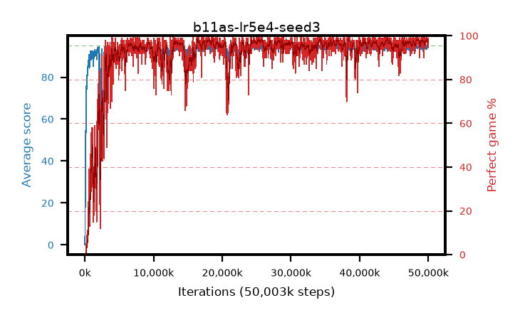

# b11as-lr5e4-seed3

step **50,003,968** · 3052 evals · trailing **94.49** · peak **94.67** @48,627,712 · sef **92.2** · best30 **98.1** @48,627,712

## Config

| | |
|---|---|
| algo | ppo |
| collect_envs | 128 |
| discount | 0.99 |
| eval_interval | 16384 |
| eval_queue | True |
| eval_queue_depth | 16 |
| eval_workers | 8 |
| fc_layers | (320,) |
| graph_eval_episodes | 100 |
| max_steps | 50003968 |
| min_checkpoint_score | 40.0 |
| ppo_adam_epsilon | 1e-07 |
| ppo_anneal_fraction | 1.0 |
| ppo_clip | 0.2 |
| ppo_clip_final | None |
| ppo_entropy_coef | 0.01 |
| ppo_entropy_coef_final | None |
| ppo_epochs | 4 |
| ppo_gae_lambda | 0.99 |
| ppo_gradient_clipping | 0.5 |
| ppo_horizon | 50.3 |
| ppo_learning_rate | 0.0005 |
| ppo_learning_rate_final | None |
| ppo_minibatch | 256 |
| ppo_normalize_adv | True |
| ppo_rollout | 128 |
| ppo_target_kl | 0.0 |
| ppo_transitions_per_rollout | 16384 |
| ppo_value_loss | huber |
| ppo_vf_coef | 0.5 |
| seed | 3 |
| torch_threads | 1 |

## Evals

| step | avg score | trailing avg | min score | max score | avg reward | perfect % | epsilon |
|---|---|---|---|---|---|---|---|
| 16384 | 0.08 | 0.08 | 0.0 | 1.0 | -4.29 | 0.0 |  |
| 32768 | 6.63 | 3.35 | 0.0 | 25.0 | 4.825 | 0.0 |  |
| 49152 | 23.59 | 13.84 | 0.0 | 51.0 | 19.22 | 0.0 |  |
| ... | ... | ... | ... | ... | ... | ... | ... |
| 49823744 | 94.83 | 94.4 | 88.0 | 95.0 | 190.8 | 97.0 |  |
| 49840128 | 94.44 | 94.52 | 72.0 | 95.0 | 189.46 | 96.0 |  |
| 49856512 | 94.4 | 94.41 | 40.0 | 95.0 | 191.365 | 98.0 |  |
| 49872896 | 94.95 | 94.47 | 90.0 | 95.0 | 192.955 | 99.0 |  |
| 49889280 | 94.05 | 94.34 | 59.0 | 95.0 | 189.07 | 96.0 |  |
| 49905664 | 94.48 | 94.5 | 66.0 | 95.0 | 191.49 | 98.0 |  |
| 49922048 | 94.24 | 94.49 | 57.0 | 95.0 | 189.215 | 96.0 |  |
| 49938432 | 94.87 | 94.39 | 82.0 | 95.0 | 192.875 | 99.0 |  |
| 49954816 | 94.27 | 94.48 | 64.0 | 95.0 | 189.29 | 96.0 |  |
| 49971200 | 94.49 | 94.48 | 44.0 | 95.0 | 192.45 | 99.0 |  |
| 49987584 | 94.15 | 94.49 | 63.0 | 95.0 | 188.13 | 95.0 |  |
| 50003968 | 94.73 | 94.49 | 75.0 | 95.0 | 190.745 | 97.0 |  |
