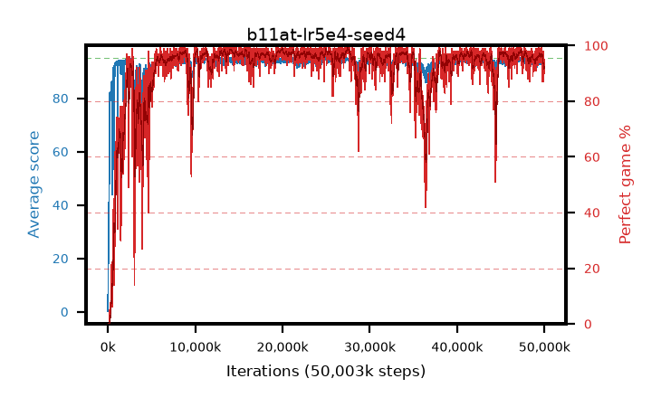

# b11at-lr5e4-seed4

step **50,003,968** · 3052 evals · trailing **93.9** · peak **94.57** @27,557,888 · sef **90.4** · best30 **98.4** @27,623,424

## Config

| | |
|---|---|
| algo | ppo |
| collect_envs | 128 |
| discount | 0.99 |
| eval_interval | 16384 |
| eval_queue | True |
| eval_queue_depth | 16 |
| eval_workers | 8 |
| fc_layers | (320,) |
| graph_eval_episodes | 100 |
| max_steps | 50003968 |
| min_checkpoint_score | 40.0 |
| ppo_adam_epsilon | 1e-07 |
| ppo_anneal_fraction | 1.0 |
| ppo_clip | 0.2 |
| ppo_clip_final | None |
| ppo_entropy_coef | 0.01 |
| ppo_entropy_coef_final | None |
| ppo_epochs | 4 |
| ppo_gae_lambda | 0.99 |
| ppo_gradient_clipping | 0.5 |
| ppo_horizon | 50.3 |
| ppo_learning_rate | 0.0005 |
| ppo_learning_rate_final | None |
| ppo_minibatch | 256 |
| ppo_normalize_adv | True |
| ppo_rollout | 128 |
| ppo_target_kl | 0.0 |
| ppo_transitions_per_rollout | 16384 |
| ppo_value_loss | huber |
| ppo_vf_coef | 0.5 |
| seed | 4 |
| torch_threads | 1 |

## Evals

| step | avg score | trailing avg | min score | max score | avg reward | perfect % | epsilon |
|---|---|---|---|---|---|---|---|
| 16384 | 0.2 | 0.2 | 0.0 | 2.0 | -0.345 | 0.0 |  |
| 32768 | 13.3 | 12.95 | 0.0 | 32.0 | 8.66 | 0.0 |  |
| 49152 | 25.35 | 12.78 | 4.0 | 44.0 | 20.35 | 0.0 |  |
| ... | ... | ... | ... | ... | ... | ... | ... |
| 49823744 | 93.5 | 93.93 | 28.0 | 95.0 | 186.53 | 94.0 |  |
| 49840128 | 94.2 | 93.95 | 71.0 | 95.0 | 188.225 | 95.0 |  |
| 49856512 | 93.79 | 93.97 | 69.0 | 95.0 | 184.83 | 92.0 |  |
| 49872896 | 94.66 | 94.0 | 75.0 | 95.0 | 191.67 | 98.0 |  |
| 49889280 | 93.45 | 93.99 | 68.0 | 95.0 | 179.47 | 87.0 |  |
| 49905664 | 93.2 | 93.87 | 28.0 | 95.0 | 181.21 | 89.0 |  |
| 49922048 | 93.9 | 93.94 | 70.0 | 95.0 | 184.94 | 92.0 |  |
| 49938432 | 93.25 | 93.89 | 26.0 | 95.0 | 182.3 | 90.0 |  |
| 49954816 | 94.08 | 93.9 | 74.0 | 95.0 | 184.035 | 91.0 |  |
| 49971200 | 94.21 | 93.93 | 70.0 | 95.0 | 187.24 | 94.0 |  |
| 49987584 | 94.26 | 93.93 | 60.0 | 95.0 | 188.285 | 95.0 |  |
| 50003968 | 93.16 | 93.9 | 59.0 | 95.0 | 183.205 | 91.0 |  |
