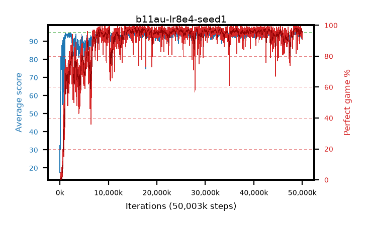

# b11au-lr8e4-seed1

step **50,003,968** · 3052 evals · trailing **93.98** · peak **94.45** @15,450,112 · sef **87.5** · best30 **98.1** @24,363,008

## Config

| | |
|---|---|
| algo | ppo |
| collect_envs | 128 |
| discount | 0.99 |
| eval_interval | 16384 |
| eval_queue | True |
| eval_queue_depth | 16 |
| eval_workers | 8 |
| fc_layers | (320,) |
| graph_eval_episodes | 100 |
| max_steps | 50003968 |
| min_checkpoint_score | 40.0 |
| ppo_adam_epsilon | 1e-07 |
| ppo_anneal_fraction | 1.0 |
| ppo_clip | 0.2 |
| ppo_clip_final | None |
| ppo_entropy_coef | 0.01 |
| ppo_entropy_coef_final | None |
| ppo_epochs | 4 |
| ppo_gae_lambda | 0.99 |
| ppo_gradient_clipping | 0.5 |
| ppo_horizon | 50.3 |
| ppo_learning_rate | 0.0008 |
| ppo_learning_rate_final | None |
| ppo_minibatch | 256 |
| ppo_normalize_adv | True |
| ppo_rollout | 128 |
| ppo_target_kl | 0.0 |
| ppo_transitions_per_rollout | 16384 |
| ppo_value_loss | huber |
| ppo_vf_coef | 0.5 |
| seed | 1 |
| torch_threads | 1 |

## Evals

| step | avg score | trailing avg | min score | max score | avg reward | perfect % | epsilon |
|---|---|---|---|---|---|---|---|
| 16384 | 17.32 | 17.32 | 3.0 | 32.0 | 13.85 | 0.0 |  |
| 32768 | 42.82 | 30.27 | 2.0 | 90.0 | 38.585 | 0.0 |  |
| 49152 | 29.97 | 23.64 | 3.0 | 54.0 | 25.105 | 0.0 |  |
| ... | ... | ... | ... | ... | ... | ... | ... |
| 49823744 | 94.09 | 94.04 | 14.0 | 95.0 | 191.055 | 98.0 |  |
| 49840128 | 94.06 | 93.98 | 30.0 | 95.0 | 191.07 | 98.0 |  |
| 49856512 | 94.26 | 94.01 | 28.0 | 95.0 | 191.27 | 98.0 |  |
| 49872896 | 91.78 | 93.97 | 9.0 | 95.0 | 184.765 | 94.0 |  |
| 49889280 | 93.39 | 93.99 | 16.0 | 95.0 | 188.41 | 96.0 |  |
| 49905664 | 94.32 | 94.01 | 51.0 | 95.0 | 190.245 | 97.0 |  |
| 49922048 | 93.28 | 93.96 | 19.0 | 95.0 | 187.17 | 95.0 |  |
| 49938432 | 93.71 | 93.99 | 26.0 | 95.0 | 187.645 | 95.0 |  |
| 49954816 | 93.79 | 93.95 | 26.0 | 95.0 | 187.815 | 95.0 |  |
| 49971200 | 93.18 | 93.94 | 32.0 | 95.0 | 183.18 | 91.0 |  |
| 49987584 | 93.83 | 93.97 | 18.0 | 95.0 | 188.76 | 96.0 |  |
| 50003968 | 93.98 | 93.98 | 66.0 | 95.0 | 185.925 | 93.0 |  |
