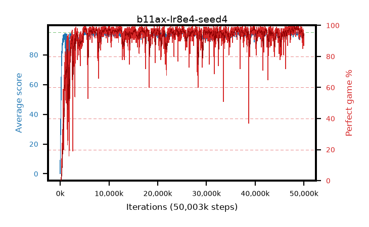

# b11ax-lr8e4-seed4

step **50,003,968** · 3052 evals · trailing **93.11** · peak **94.54** @48,398,336 · sef **94.3** · best30 **98.2** @48,545,792

## Config

| | |
|---|---|
| algo | ppo |
| collect_envs | 128 |
| discount | 0.99 |
| eval_interval | 16384 |
| eval_queue | True |
| eval_queue_depth | 16 |
| eval_workers | 8 |
| fc_layers | (320,) |
| graph_eval_episodes | 100 |
| max_steps | 50003968 |
| min_checkpoint_score | 40.0 |
| ppo_adam_epsilon | 1e-07 |
| ppo_anneal_fraction | 1.0 |
| ppo_clip | 0.2 |
| ppo_clip_final | None |
| ppo_entropy_coef | 0.01 |
| ppo_entropy_coef_final | None |
| ppo_epochs | 4 |
| ppo_gae_lambda | 0.99 |
| ppo_gradient_clipping | 0.5 |
| ppo_horizon | 50.3 |
| ppo_learning_rate | 0.0008 |
| ppo_learning_rate_final | None |
| ppo_minibatch | 256 |
| ppo_normalize_adv | True |
| ppo_rollout | 128 |
| ppo_target_kl | 0.0 |
| ppo_transitions_per_rollout | 16384 |
| ppo_value_loss | huber |
| ppo_vf_coef | 0.5 |
| seed | 4 |
| torch_threads | 1 |

## Evals

| step | avg score | trailing avg | min score | max score | avg reward | perfect % | epsilon |
|---|---|---|---|---|---|---|---|
| 16384 | 0.13 | 0.13 | 0.0 | 2.0 | -0.415 | 0.0 |  |
| 32768 | 16.04 | 8.08 | 1.0 | 46.0 | 13.335 | 0.0 |  |
| 49152 | 31.11 | 15.76 | 12.0 | 55.0 | 26.11 | 0.0 |  |
| ... | ... | ... | ... | ... | ... | ... | ... |
| 49823744 | 92.31 | 93.67 | 9.0 | 95.0 | 185.34 | 94.0 |  |
| 49840128 | 93.47 | 93.62 | 58.0 | 95.0 | 186.5 | 94.0 |  |
| 49856512 | 93.07 | 93.27 | 42.0 | 95.0 | 187.05 | 95.0 |  |
| 49872896 | 92.8 | 93.32 | 7.0 | 95.0 | 188.725 | 97.0 |  |
| 49889280 | 93.76 | 93.31 | 17.0 | 95.0 | 189.73 | 97.0 |  |
| 49905664 | 92.72 | 93.38 | 33.0 | 95.0 | 185.66 | 94.0 |  |
| 49922048 | 93.57 | 93.6 | 21.0 | 95.0 | 189.54 | 97.0 |  |
| 49938432 | 90.22 | 93.45 | 18.0 | 95.0 | 175.97 | 87.0 |  |
| 49954816 | 92.07 | 93.54 | 18.0 | 95.0 | 183.79 | 93.0 |  |
| 49971200 | 92.18 | 93.21 | 8.0 | 95.0 | 184.125 | 93.0 |  |
| 49987584 | 93.55 | 93.1 | 23.0 | 95.0 | 184.5 | 92.0 |  |
| 50003968 | 92.78 | 93.11 | 14.0 | 95.0 | 182.645 | 91.0 |  |
