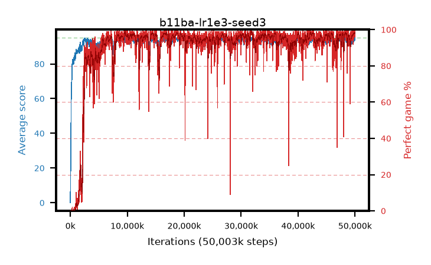

# b11ba-lr1e3-seed3

step **50,003,968** · 3052 evals · trailing **94.29** · peak **94.45** @19,693,568 · sef **91.8** · best30 **97.9** @14,532,608

## Config

| | |
|---|---|
| algo | ppo |
| collect_envs | 128 |
| discount | 0.99 |
| eval_interval | 16384 |
| eval_queue | True |
| eval_queue_depth | 16 |
| eval_workers | 8 |
| fc_layers | (320,) |
| graph_eval_episodes | 100 |
| max_steps | 50003968 |
| min_checkpoint_score | 40.0 |
| ppo_adam_epsilon | 1e-07 |
| ppo_anneal_fraction | 1.0 |
| ppo_clip | 0.2 |
| ppo_clip_final | None |
| ppo_entropy_coef | 0.01 |
| ppo_entropy_coef_final | None |
| ppo_epochs | 4 |
| ppo_gae_lambda | 0.99 |
| ppo_gradient_clipping | 0.5 |
| ppo_horizon | 50.3 |
| ppo_learning_rate | 0.001 |
| ppo_learning_rate_final | None |
| ppo_minibatch | 256 |
| ppo_normalize_adv | True |
| ppo_rollout | 128 |
| ppo_target_kl | 0.0 |
| ppo_transitions_per_rollout | 16384 |
| ppo_value_loss | huber |
| ppo_vf_coef | 0.5 |
| seed | 3 |
| torch_threads | 1 |

## Evals

| step | avg score | trailing avg | min score | max score | avg reward | perfect % | epsilon |
|---|---|---|---|---|---|---|---|
| 16384 | 0.07 | 0.07 | 0.0 | 2.0 | -3.76 | 0.0 |  |
| 32768 | 11.76 | 16.85 | 0.0 | 32.0 | 9.64 | 0.0 |  |
| 49152 | 21.85 | 10.96 | 0.0 | 45.0 | 17.39 | 0.0 |  |
| ... | ... | ... | ... | ... | ... | ... | ... |
| 49823744 | 94.25 | 93.65 | 57.0 | 95.0 | 191.26 | 98.0 |  |
| 49840128 | 94.35 | 93.78 | 60.0 | 95.0 | 190.365 | 97.0 |  |
| 49856512 | 95.0 | 94.04 | 95.0 | 95.0 | 194.0 | 100.0 |  |
| 49872896 | 94.05 | 94.17 | 44.0 | 95.0 | 190.02 | 97.0 |  |
| 49889280 | 94.01 | 94.13 | 35.0 | 95.0 | 190.975 | 98.0 |  |
| 49905664 | 93.36 | 94.12 | 17.0 | 95.0 | 189.33 | 97.0 |  |
| 49922048 | 94.49 | 94.09 | 44.0 | 95.0 | 192.45 | 99.0 |  |
| 49938432 | 94.05 | 94.1 | 3.0 | 95.0 | 191.06 | 98.0 |  |
| 49954816 | 94.66 | 94.12 | 61.0 | 95.0 | 192.665 | 99.0 |  |
| 49971200 | 94.12 | 94.18 | 7.0 | 95.0 | 192.125 | 99.0 |  |
| 49987584 | 93.54 | 94.18 | 1.0 | 95.0 | 188.56 | 96.0 |  |
| 50003968 | 94.66 | 94.29 | 64.0 | 95.0 | 191.67 | 98.0 |  |
