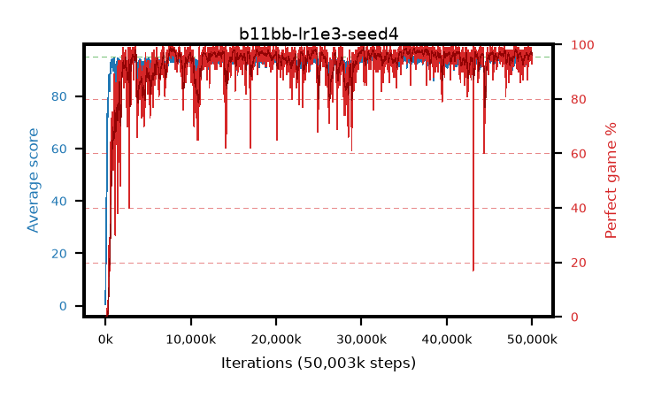

# b11bb-lr1e3-seed4

step **50,003,968** · 3052 evals · trailing **94.04** · peak **94.44** @35,422,208 · sef **94.5** · best30 **98.2** @7,929,856

## Config

| | |
|---|---|
| algo | ppo |
| collect_envs | 128 |
| discount | 0.99 |
| eval_interval | 16384 |
| eval_queue | True |
| eval_queue_depth | 16 |
| eval_workers | 8 |
| fc_layers | (320,) |
| graph_eval_episodes | 100 |
| max_steps | 50003968 |
| min_checkpoint_score | 40.0 |
| ppo_adam_epsilon | 1e-07 |
| ppo_anneal_fraction | 1.0 |
| ppo_clip | 0.2 |
| ppo_clip_final | None |
| ppo_entropy_coef | 0.01 |
| ppo_entropy_coef_final | None |
| ppo_epochs | 4 |
| ppo_gae_lambda | 0.99 |
| ppo_gradient_clipping | 0.5 |
| ppo_horizon | 50.3 |
| ppo_learning_rate | 0.001 |
| ppo_learning_rate_final | None |
| ppo_minibatch | 256 |
| ppo_normalize_adv | True |
| ppo_rollout | 128 |
| ppo_target_kl | 0.0 |
| ppo_transitions_per_rollout | 16384 |
| ppo_value_loss | huber |
| ppo_vf_coef | 0.5 |
| seed | 4 |
| torch_threads | 1 |

## Evals

| step | avg score | trailing avg | min score | max score | avg reward | perfect % | epsilon |
|---|---|---|---|---|---|---|---|
| 16384 | 0.51 | 0.51 | 0.0 | 2.0 | -1.7 | 0.0 |  |
| 32768 | 9.09 | 11.36 | 0.0 | 26.0 | 5.62 | 0.0 |  |
| 49152 | 24.49 | 12.5 | 8.0 | 45.0 | 19.49 | 0.0 |  |
| ... | ... | ... | ... | ... | ... | ... | ... |
| 49823744 | 94.69 | 94.01 | 69.0 | 95.0 | 191.7 | 98.0 |  |
| 49840128 | 93.91 | 94.07 | 65.0 | 95.0 | 187.935 | 95.0 |  |
| 49856512 | 94.06 | 94.07 | 27.0 | 95.0 | 191.025 | 98.0 |  |
| 49872896 | 94.92 | 94.07 | 87.0 | 95.0 | 192.925 | 99.0 |  |
| 49889280 | 94.56 | 94.12 | 56.0 | 95.0 | 191.57 | 98.0 |  |
| 49905664 | 94.35 | 94.12 | 65.0 | 95.0 | 190.365 | 97.0 |  |
| 49922048 | 94.43 | 94.09 | 63.0 | 95.0 | 191.44 | 98.0 |  |
| 49938432 | 93.76 | 94.05 | 57.0 | 95.0 | 185.75 | 93.0 |  |
| 49954816 | 94.46 | 94.11 | 65.0 | 95.0 | 190.475 | 97.0 |  |
| 49971200 | 92.98 | 94.12 | 17.0 | 95.0 | 185.92 | 94.0 |  |
| 49987584 | 92.56 | 94.1 | 2.0 | 95.0 | 185.545 | 94.0 |  |
| 50003968 | 93.64 | 94.04 | 65.0 | 95.0 | 185.675 | 93.0 |  |
