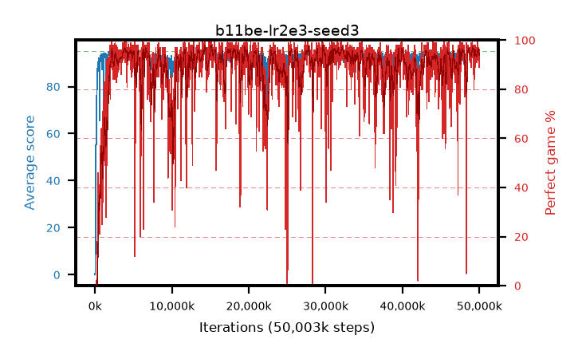

# b11be-lr2e3-seed3

step **50,003,968** · 3052 evals · trailing **93.71** · peak **94.23** @47,841,280 · sef **87.2** · best30 **96.3** @14,401,536

## Config

| | |
|---|---|
| algo | ppo |
| collect_envs | 128 |
| discount | 0.99 |
| eval_interval | 16384 |
| eval_queue | True |
| eval_queue_depth | 16 |
| eval_workers | 8 |
| fc_layers | (320,) |
| graph_eval_episodes | 100 |
| max_steps | 50003968 |
| min_checkpoint_score | 40.0 |
| ppo_adam_epsilon | 1e-07 |
| ppo_anneal_fraction | 1.0 |
| ppo_clip | 0.2 |
| ppo_clip_final | None |
| ppo_entropy_coef | 0.01 |
| ppo_entropy_coef_final | None |
| ppo_epochs | 4 |
| ppo_gae_lambda | 0.99 |
| ppo_gradient_clipping | 0.5 |
| ppo_horizon | 50.3 |
| ppo_learning_rate | 0.002 |
| ppo_learning_rate_final | None |
| ppo_minibatch | 256 |
| ppo_normalize_adv | True |
| ppo_rollout | 128 |
| ppo_target_kl | 0.0 |
| ppo_transitions_per_rollout | 16384 |
| ppo_value_loss | huber |
| ppo_vf_coef | 0.5 |
| seed | 3 |
| torch_threads | 1 |

## Evals

| step | avg score | trailing avg | min score | max score | avg reward | perfect % | epsilon |
|---|---|---|---|---|---|---|---|
| 16384 | 0.09 | 0.09 | 0.0 | 1.0 | -4.91 | 0.0 |  |
| 32768 | 1.25 | 0.67 | 0.0 | 8.0 | 0.75 | 0.0 |  |
| 49152 | 18.12 | 6.49 | 2.0 | 35.0 | 13.21 | 0.0 |  |
| ... | ... | ... | ... | ... | ... | ... | ... |
| 49823744 | 94.09 | 93.57 | 62.0 | 95.0 | 186.125 | 93.0 |  |
| 49840128 | 92.91 | 93.53 | 41.0 | 95.0 | 184.72 | 93.0 |  |
| 49856512 | 93.46 | 93.49 | 42.0 | 95.0 | 187.44 | 95.0 |  |
| 49872896 | 93.37 | 93.47 | 34.0 | 95.0 | 188.255 | 96.0 |  |
| 49889280 | 93.2 | 93.48 | 59.0 | 95.0 | 184.06 | 92.0 |  |
| 49905664 | 94.22 | 93.52 | 35.0 | 95.0 | 190.19 | 97.0 |  |
| 49922048 | 94.31 | 93.62 | 61.0 | 95.0 | 190.28 | 97.0 |  |
| 49938432 | 93.23 | 93.45 | 16.0 | 95.0 | 186.08 | 94.0 |  |
| 49954816 | 93.9 | 93.72 | 57.0 | 95.0 | 184.895 | 92.0 |  |
| 49971200 | 93.33 | 93.41 | 27.0 | 95.0 | 186.315 | 94.0 |  |
| 49987584 | 93.94 | 93.5 | 50.0 | 95.0 | 184.845 | 92.0 |  |
| 50003968 | 92.58 | 93.71 | 46.0 | 95.0 | 180.455 | 89.0 |  |
